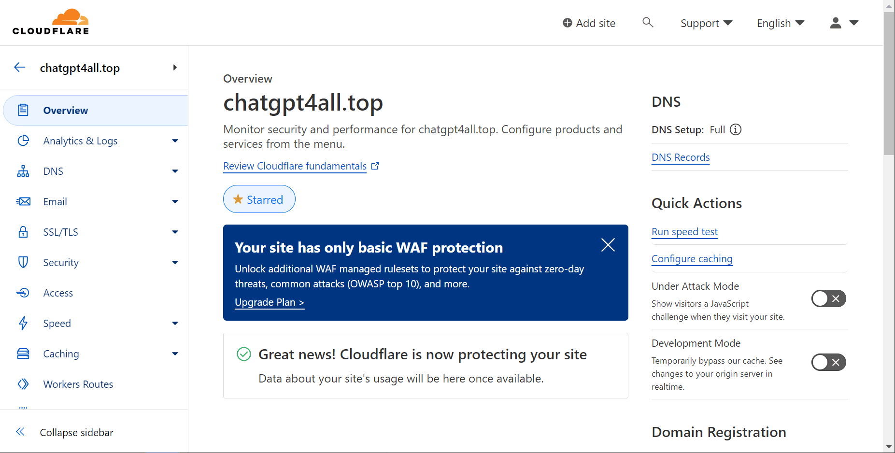
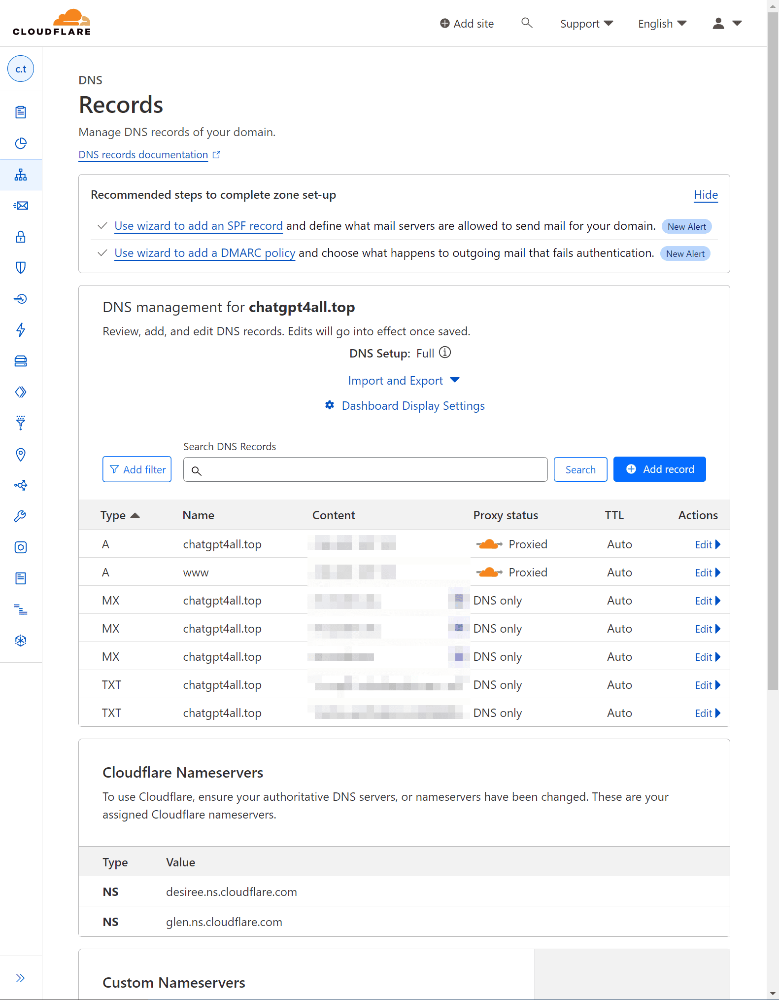
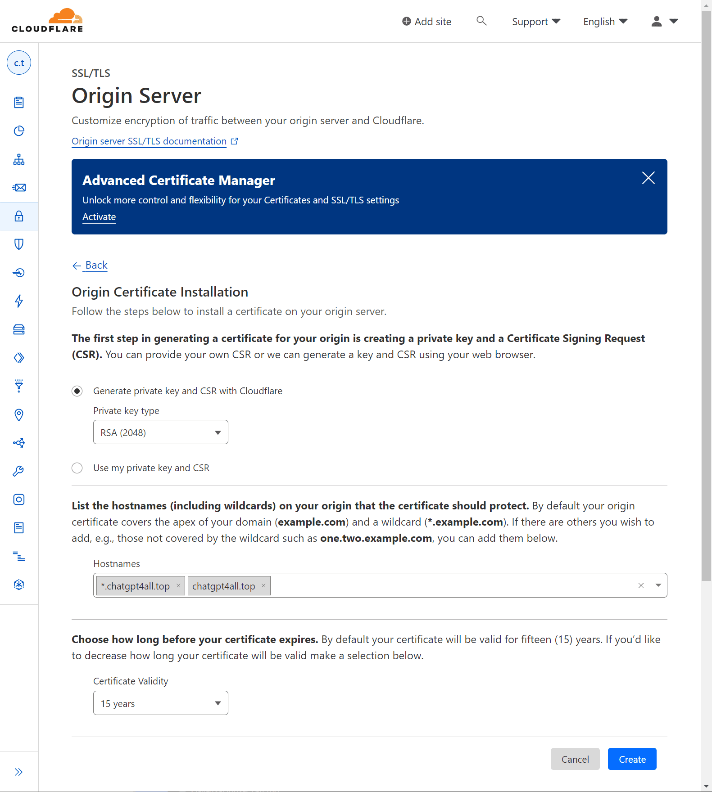
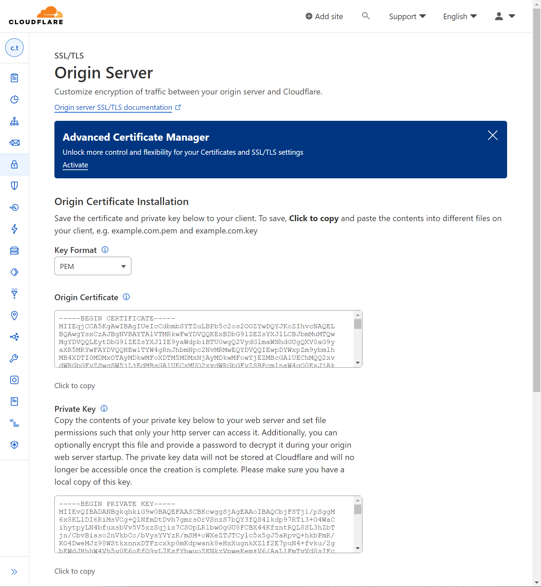

# ChatGPT4All Backend

This project provides the backend API for my GPTs, such as [Action Hello](/Day-58-Action-Hello.md).

## Table of Contents

- [Setup](#setup) 
- [main.py](#main.py)
- [Development](#development)
- [Production](#production)
- [License](#license)

## Setup

1. Clone the repo
   ```
   git clone https://github.com/BlueBirdBack/100-Days-of-GPTs
   cd 100-Days-of-GPTs
   cd 58/backend
   ```
2. Install dependencies 
   ```
   pip install -r requirements.txt
   ```
3. Configure Cloudflare settings
   - Log into your Cloudflare account
   - Add a new site for chatgpt4all.top
     
   - Configure DNS records as shown in the image
     
4. Generate SSL certificate
   - In Cloudflare, go to SSL/TLS > Origin Server
     
   - Create a new certificate 
     
   - Save the Origin Certificate as `chatgpt4all.top.pem`
   - Save the Private Key as `chatgpt4all.top.key`
5. Upload the certificate files to your server

## main.py

```python
from fastapi import FastAPI
import uvicorn

app = FastAPI()

@app.get("/")
def read_root():
    return {"message": "Hello, World!"}

if __name__ == "__main__":
    uvicorn.run("main:app", 
                host="0.0.0.0", 
                port=443, 
                ssl_keyfile="/root/projects/chatgpt4all.top.key", 
                ssl_certfile="/root/projects/chatgpt4all.top.pem")

```

## Development

To run the backend in development mode:
```
python main.py
```

## Production

To run the backend in production mode:
```
nohup python main.py &
```

## License

[MIT](/LICENSE)
