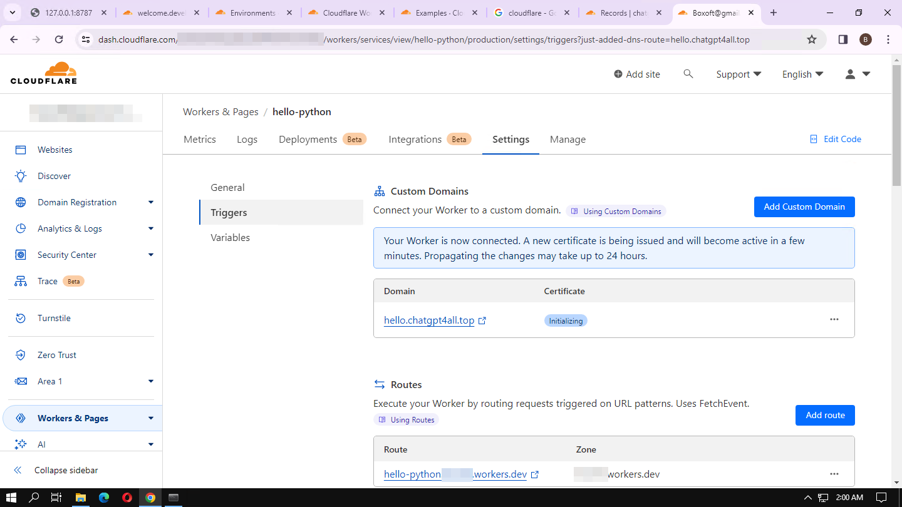

# "Action Hello" Backend

This project delivers the backend API for the ["Action Hello"](/Day-58-Action-Hello.md) GPT. It leverages Cloudflare's Python Workers to provide serverless backend capabilities.

## Setup

Clone the repo

```
git clone https://github.com/BlueBirdBack/100-Days-of-GPTs
cd 100-Days-of-GPTs 
cd 58/backend
```

## Development

To run the Python Worker locally:
```
npx wrangler@latest dev
```

This will start a local development server and provide a URL to test your Worker.

## Deployment

To deploy the Python Worker to Cloudflare:
```
npx wrangler@latest deploy
```

This will deploy your Worker to Cloudflare's serverless infrastructure.

To configure a custom domain name for the worker, follow these steps:

1. Log in to the [Cloudflare Workers dashboard](https://dash.cloudflare.com/).

2. Navigate to the "hello-python" Worker by clicking on it in the Workers list.

3. In the "Triggers" section, locate the "Custom Domains" section. Click on "Add Custom Domain" to connect your Worker to a custom domain like "hello.chaingptail.top".

4. Enter the desired custom domain in the provided field.

5. Cloudflare will issue a new certificate for the custom domain, which may take a few minutes to become active. The changes may take up to 24 hours to propagate fully.

6. Once the custom domain is connected, you can configure any additional settings or routes as needed for your Worker.



## License

[MIT](/LICENSE)
