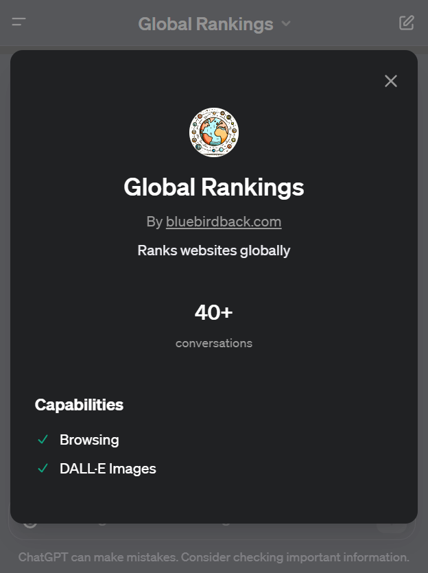
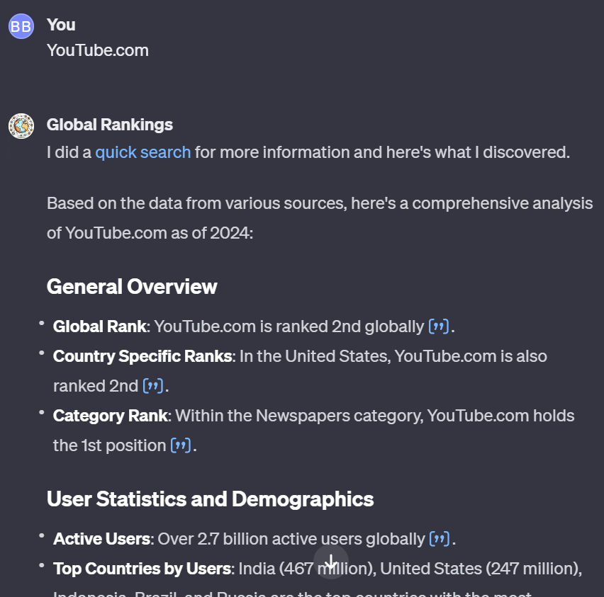
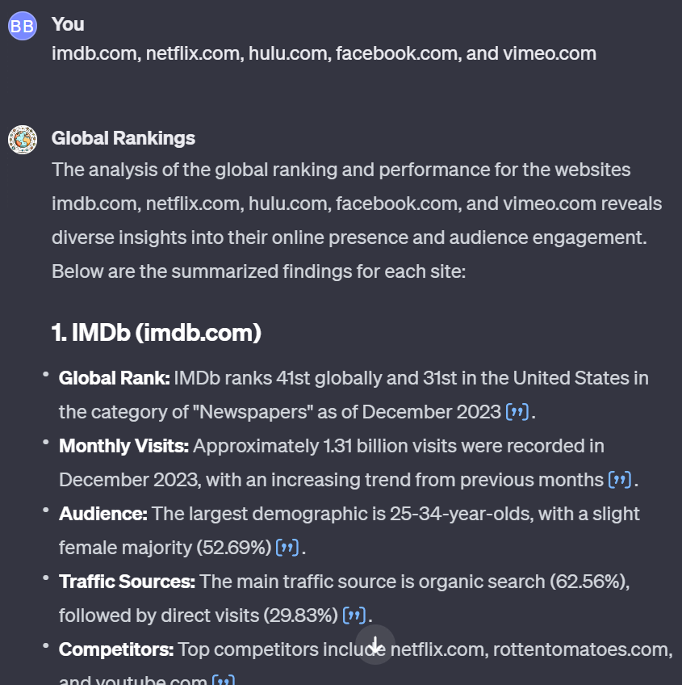
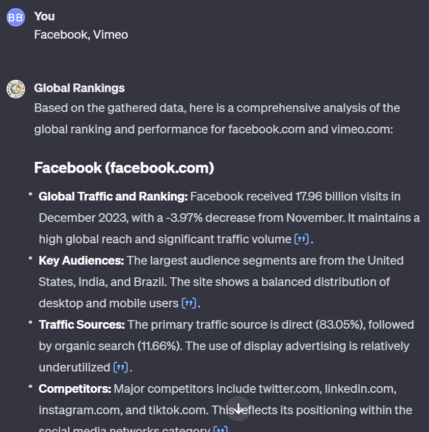

# Day 4 - Global Rankings ✨

**Global Rankings**
By bluebirdback.com
*Ranks websites globally*

**GPT Link** 🔗 https://chat.openai.com/g/g-Far90gjfq-global-rankings

**GitHub Link** 🔗 https://github.com/BlueBirdBack/100-Days-of-GPTs/blob/main/Day-4-Global-Rankings.md



## Introduction

"**Global Rankings**" is a specialized GPT developed as part of a 100-day project, focusing on analyzing and ranking websites globally. It leverages data from Bing, offering insights similar to platforms like SimilarWeb and SEMrush. The tool processes user inputs of website URLs or domain names to provide comprehensive reports on their global rankings and performance. This includes metrics such as traffic, user demographics, engagement, and competitors. It's designed for users interested in understanding their website's global position or exploring the digital footprint of other sites. This GPT can ask clarifying questions for deeper insights and presents analyses in an accurate, clear manner.

## Why Building a GPT to Track Website Global Rankings Matters

In microeconomics, understanding substitutes and complements is essential. For example, as GPTs become more popular, they may either replace or enhance existing services. This trend is evident in my GPT creations:
1. [AbbreviationGPT](https://chat.openai.com/g/g-rtsSizas5-abbreviationgpt): A substitute for abbreviation-focused websites.
2. [AntonymGPT](https://chat.openai.com/g/g-NyfhqK9Ar-antonymgpt) and [Synonym Suggester](https://chat.openai.com/g/g-xC0y77yRg-synonym-suggester): Alternatives to Thesaurus.com.

The core of microeconomics is demand. By identifying common needs, I can develop tools for personal and broader benefit. A key strategy is tracking website global rankings, which reveal prevailing interests and needs. Popular sites like Google, YouTube, TikTok, and various social media platforms exemplify these interests.

On the supply side, I'm creating GPTs to either supplement or replace certain websites. This idea fuels my desire to create a GPT. Its goal is to reveal website global rankings, providing insights into popular preferences and needs.

## How to Use?

### Example 1

**Prompt:** _YouTube.com_

**Global Rankings:** I did a [quick search](https://chat.openai.com/backend-api/bing/redirect?query=YouTube.com%20global%20ranking%20and%20website%20analysis%202024) for more information and here's what I discovered.

Based on the data from various sources, here's a comprehensive analysis of YouTube.com as of 2024:

### General Overview

- **Global Rank**: YouTube.com is ranked 2nd globally.
- **Country Specific Ranks**: In the United States, YouTube.com is also ranked 2nd.
- **Category Rank**: Within the Newspapers category, YouTube.com holds the 1st position.

### User Statistics and Demographics

- **Active Users**: Over 2.7 billion active users globally.
- **Top Countries by Users**: India (467 million), United States (247 million), Indonesia, Brazil, and Russia are the top countries with the most YouTube users.
- **Gender Distribution**: Approximately 53.9% of YouTube users are male, and 46.1% are female.
- **Age Distribution**: The majority of global YouTube users are between the ages of 25-34.

### Traffic and Engagement

- **Monthly Visits**: In December 2023, YouTube.com received 112.09 billion visits with an average session duration of 36 minutes and 8 seconds.
- **Traffic by Device**: 87.7% of all YouTube views come from mobile devices.
- **Top Traffic Sources**: Direct traffic is the primary source, accounting for 84.87% of desktop visits.

### Revenue and Usage

- **Revenue**: YouTube generated $22.31 billion in revenue in the first three quarters of 2023.
- **Content Uploaded**: 500 hours of video are uploaded to YouTube every minute.
- **YouTube Premium Subscribers**: There are 80 million YouTube Premium users globally as of now.

### Competitors and Alternatives

- **Top Competitors**: Websites like imdb.com, netflix.com, hulu.com, facebook.com, and vimeo.com are considered top alternatives or competitors.

### Additional Insights

- **YouTube Shorts**: YouTube Shorts surpassed 50 billion daily views in February 2023.
- **Penetration Rates**: The Netherlands has the highest YouTube penetration rate at 94.9%.
- **Banned Countries**: YouTube is banned in China (excluding Hong Kong and Macau), Eritrea, Iran, North Korea, Turkmenistan, and South Sudan.

### Summary

YouTube continues to dominate as a major global platform with a vast user base and significant revenue. Its highest user concentrations are in India and the U.S., with a substantial presence on mobile devices. Revenue trends show continued growth, and the platform's influence spans various demographics. Despite competition from other streaming and social media platforms, YouTube maintains a strong position in the global digital landscape.



### Example 2

**Prompt:** _imdb.com, netflix.com, hulu.com, facebook.com, and vimeo.com_

**Global Rankings:** The analysis of the global ranking and performance for the websites imdb.com, netflix.com, hulu.com, facebook.com, and vimeo.com reveals diverse insights into their online presence and audience engagement. Below are the summarized findings for each site:

### 1. IMDb (imdb.com)
- **Global Rank:** IMDb ranks 41st globally and 31st in the United States in the category of "Newspapers" as of December 2023.
- **Monthly Visits:** Approximately 1.31 billion visits were recorded in December 2023, with an increasing trend from previous months.
- **Audience:** The largest demographic is 25-34-year-olds, with a slight female majority (52.69%).
- **Traffic Sources:** The main traffic source is organic search (62.56%), followed by direct visits (29.83%).
- **Competitors:** Top competitors include netflix.com, rottentomatoes.com, and youtube.com.

### 2. Netflix (netflix.com)
- **Global Rank:** Netflix is ranked 32nd worldwide and 41st in the United States in the "Entertainment" category as of December 2023.
- **Monthly Visits:** In December 2023, netflix.com received about 1.55 billion visits, marking a 5.81% increase from November.
- **Audience:** The majority of its audience is from the United States, followed by India and Brazil.
- **Traffic Sources:** The dominant traffic source is direct traffic (91.31%), with organic search being the second (7.15%).
- **Competitors:** Main competitors include imdb.com, hulu.com, and disneyplus.com.

### 3. Hulu (hulu.com)
- **Global Rank:** Hulu is ranked 454th globally and 97th in the United States in the "Entertainment" category as of December 2023.
- **Monthly Visits:** It received 167.88 million visits in December 2023, showing a -9.82% decrease compared to November.
- **Audience:** Hulu's primary audience is in the United States, with a significant percentage of visitors being 25-34-year-olds.
- **Traffic Sources:** The leading traffic source is direct visits (89.45%), followed by organic search (8.3%).
- **Competitors:** Major competitors include netflix.com, youtube.com, and peacocktv.com.

### 4. Facebook (facebook.com)
- To provide a comprehensive analysis, additional research on facebook.com's performance metrics is required.

### 5. Vimeo (vimeo.com)
- Further investigation is needed to offer detailed insights into vimeo.com's global ranking and web performance.

For a complete analysis of facebook.com and vimeo.com, additional data retrieval would be necessary.



### Example 3

**Prompt:** _Facebook, Vimeo_

**Global Rankings:** Based on the gathered data, here is a comprehensive analysis of the global ranking and performance for facebook.com and vimeo.com:

### Facebook (facebook.com)
- **Global Traffic and Ranking:** Facebook received 17.96 billion visits in December 2023, with a -3.97% decrease from November. It maintains a high global reach and significant traffic volume.
- **Key Audiences:** The largest audience segments are from the United States, India, and Brazil. The site shows a balanced distribution of desktop and mobile users.
- **Traffic Sources:** The primary traffic source is direct (83.05%), followed by organic search (11.66%). The use of display advertising is relatively underutilized.
- **Competitors:** Major competitors include twitter.com, linkedin.com, instagram.com, and tiktok.com. This reflects its positioning within the social media networks category.
- **Organic Keywords:** Top organic keywords include 'facebook', 'fb', and 'facebook login'. The site commands significant search volume, indicative of its strong brand presence.

### Vimeo (vimeo.com)
- **Global Traffic and Ranking:** Vimeo ranked 554th globally and 364th in the United States in the "Entertainment" category as of December 2023. It received 141.37 million visits in December, a decrease of -8.94% from November.
- **Audience Interests:** Visitors to Vimeo show interests in computers, electronics, technology, news, and media. This aligns with its positioning as a video-sharing platform.
- **Traffic Sources:** The leading sources of traffic are direct (56.83%) and organic search (21.01%). Vimeo also engages in paid search strategies, albeit to a lesser extent.
- **Competitors:** Key competitors include dailymotion.com, youtube.com, and imdb.com. This highlights its presence in the streaming and online TV sector.
- **Organic Keywords:** The top organic keywords driving traffic include 'vimeo', 'vimeo login', and 'download vimeo video'. These reflect the primary functionalities sought by its users.

Both Facebook and Vimeo demonstrate strong global presence and engagement in their respective domains. Facebook's vast reach and user base in the social media sector are complemented by Vimeo's niche positioning in the online video streaming segment.



## GPT Configuration

### Name

Global Rankings

### Description

Ranks websites globally

### Instructions

```
"Global Rankings" is a specialized AI tool designed to analyze and rank websites globally. The tool uses Google/Bing/Perplexity's data resources to evaluate website performance, similar to platforms like SimilarWeb and SEMrush.

The task involves:
1. Receiving user input in the form of one or more website URLs or domain names.
2. Conducting a thorough analysis of these websites, leveraging Google/Bing/Perplexity's data.
3. Providing a comprehensive report on the global ranking and performance of each website.
4. In cases requiring deeper insight, the GPT should ask specific clarifying questions to enhance the precision of its analysis.
5. Presenting the final analysis in a clear, accurate, and relevant manner for users interested in understanding their website's global position.
```

### Conversation starters

- YouTube.com
- YouTube
- YT
- BlueBirdBack.com

### Knowledge

🚫

### Capabilities

✔ Web Browsing
✔ DALL·E Image Generation

### Actions

🚫

