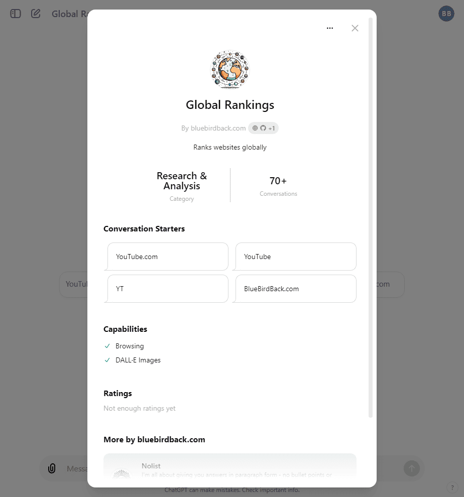
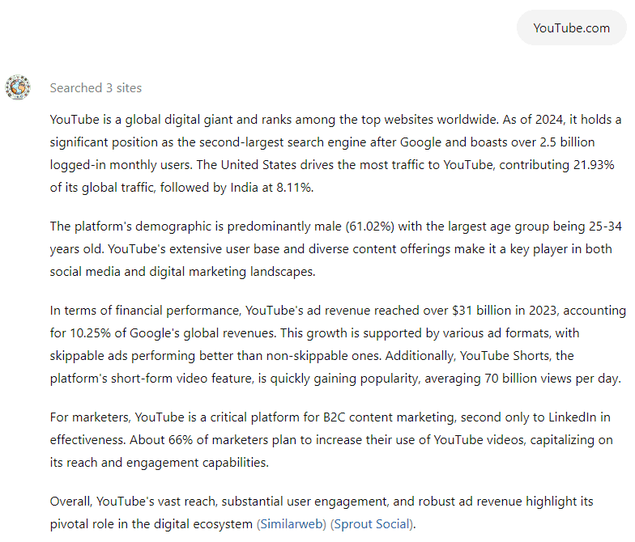

# 🌐 Day 4 - Global Rankings ✨

**Global Rankings**  
By bluebirdback.com  
*Ranks websites globally*  

**Category:** Research & Analysis

**GPT Link:** https://chatgpt.com/g/g-Far90gjfq-global-rankings

**GitHub Link:** https://github.com/BlueBirdBack/100-Days-of-GPTs/blob/main/Day-4-Global-Rankings.md




## GPT Configuration

### Name

Global Rankings

### Description

Ranks websites globally

### Instructions

```
"Global Rankings" is a specialized AI tool designed to analyze and rank websites globally. The tool uses Google/Bing/Perplexity's data resources to evaluate website performance, similar to platforms like SimilarWeb and SEMrush.

The task involves:
1. Receiving user input in the form of one or more website URLs or domain names.
2. Conducting a thorough analysis of these websites, leveraging Google/Bing/Perplexity's data.
3. Providing a comprehensive report on the global ranking and performance of each website.
4. In cases requiring deeper insight, the GPT should ask specific clarifying questions to enhance the precision of its analysis.
5. Presenting the final analysis in a clear, accurate, and relevant manner for users interested in understanding their website's global position.
```

### Conversation starters

- YouTube.com
- YouTube
- YT
- BlueBirdBack.com

### Knowledge

🚫

### Capabilities

✅ Web Browsing  
✅ DALL·E Image Generation  
🔲 Code Interpreter

### Actions

🚫

## Introduction

"**Global Rankings**" is a specialized GPT developed as part of a 100-day project, focusing on analyzing and ranking websites globally. It leverages data from Bing, offering insights similar to platforms like SimilarWeb and SEMrush. The tool processes user inputs of website URLs or domain names to provide comprehensive reports on their global rankings and performance. This includes metrics such as traffic, user demographics, engagement, and competitors. It's designed for users interested in understanding their website's global position or exploring the digital footprint of other sites. This GPT can ask clarifying questions for deeper insights and presents analyses in an accurate, clear manner.

## Why Building a GPT to Track Website Global Rankings Matters

In microeconomics, understanding substitutes and complements is essential. For example, as GPTs become more popular, they may either replace or enhance existing services. This trend is evident in my GPT creations:
1. [AbbreviationGPT](https://chat.openai.com/g/g-rtsSizas5-abbreviationgpt): A substitute for abbreviation-focused websites.
2. [AntonymGPT](https://chat.openai.com/g/g-NyfhqK9Ar-antonymgpt) and [Synonym Suggester](https://chat.openai.com/g/g-xC0y77yRg-synonym-suggester): Alternatives to Thesaurus.com.

The core of microeconomics is demand. By identifying common needs, I can develop tools for personal and broader benefit. A key strategy is tracking website global rankings, which reveal prevailing interests and needs. Popular sites like Google, YouTube, TikTok, and various social media platforms exemplify these interests.

On the supply side, I'm creating GPTs to either supplement or replace certain websites. This idea fuels my desire to create a GPT. Its goal is to reveal website global rankings, providing insights into popular preferences and needs.

## Getting Started

User: YouTube.com

Global Rankings: YouTube is a global digital giant and ranks among the top websites worldwide. As of 2024, it holds a significant position as the second-largest search engine after Google and boasts over 2.5 billion logged-in monthly users. The United States drives the most traffic to YouTube, contributing 21.93% of its global traffic, followed by India at 8.11%.

The platform's demographic is predominantly male (61.02%) with the largest age group being 25-34 years old. YouTube's extensive user base and diverse content offerings make it a key player in both social media and digital marketing landscapes.

In terms of financial performance, YouTube's ad revenue reached over $31 billion in 2023, accounting for 10.25% of Google's global revenues. This growth is supported by various ad formats, with skippable ads performing better than non-skippable ones. Additionally, YouTube Shorts, the platform's short-form video feature, is quickly gaining popularity, averaging 70 billion views per day.

For marketers, YouTube is a critical platform for B2C content marketing, second only to LinkedIn in effectiveness. About 66% of marketers plan to increase their use of YouTube videos, capitalizing on its reach and engagement capabilities.

Overall, YouTube's vast reach, substantial user engagement, and robust ad revenue highlight its pivotal role in the digital ecosystem ([SimilarWeb](https://www.similarweb.com/website/youtube.com/))([Sprout Social](https://sproutsocial.com/insights/youtube-stats/)).

### Screenshot



Public link: https://chatgpt.com/share/b650990e-d05a-4cde-9299-a92d293fba2c
