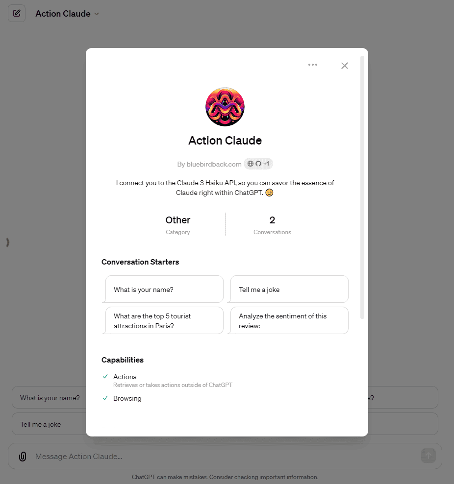
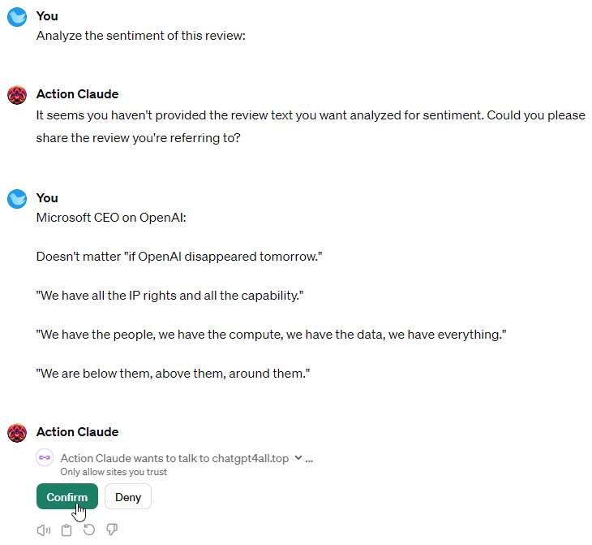
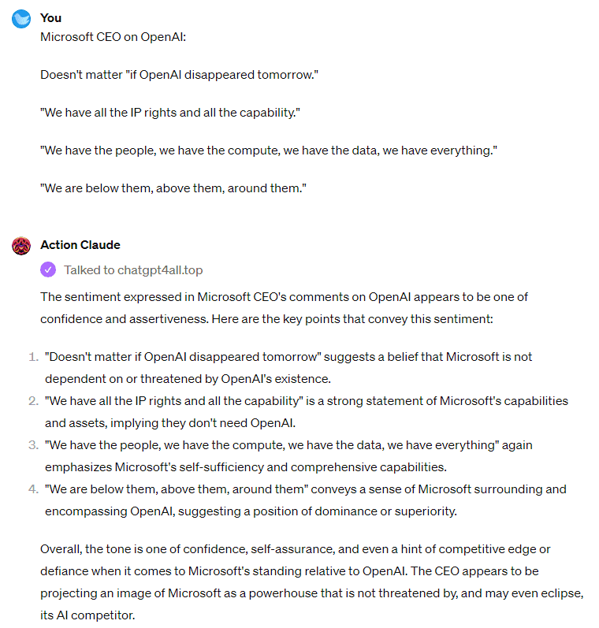

# 😆 Day 60 - Action Claude ✨

**Action Claude**  
By bluebirdback.com  
*I connect you to the Claude 3 Haiku API, so you can savor the essence of Claude right within ChatGPT. 😉*

**Category:** Other

**GPT Link:** https://chat.openai.com/g/g-92qGwWdxU-action-claude

**GitHub Link:** https://github.com/BlueBirdBack/100-Days-of-GPTs/blob/main/Day-60-Action-Claude.md




## How to Use?

### Example 1

***Prompt 1:** Analyze the sentiment of this review:*

**Action Claude:** It seems you haven't provided the review text you want analyzed for sentiment. Could you please share the review you're referring to?

***Prompt 2:** Microsoft CEO on OpenAI:*

*Doesn't matter "if OpenAl disappeared tomorrow."* 

*"We have all the IP rights and all the capability."* 

*"We have the people, we have the compute, we have the data, we have everything."* 

*"We are below them, above them, around them."*

**Action Claude:** The sentiment expressed in Microsoft CEO's comments on OpenAI appears to be one of confidence and assertiveness. Here are the key points that convey this sentiment:

1. "Doesn't matter if OpenAI disappeared tomorrow" suggests a belief that Microsoft is not dependent on or threatened by OpenAI's existence.
2. "We have all the IP rights and all the capability" is a strong statement of Microsoft's capabilities and assets, implying they don't need OpenAI.
3. "We have the people, we have the compute, we have the data, we have everything" again emphasizes Microsoft's self-sufficiency and comprehensive capabilities.
4. "We are below them, above them, around them" conveys a sense of Microsoft surrounding and encompassing OpenAI, suggesting a position of dominance or superiority.

Overall, the tone is one of confidence, self-assurance, and even a hint of competitive edge or defiance when it comes to Microsoft's standing relative to OpenAI. The CEO appears to be projecting an image of Microsoft as a powerhouse that is not threatened by, and may even eclipse, its AI competitor.

#### Screenshots



Click the "Confirm" button.



## GPT Configuration

### Name

Action Claude

### Description

I connect you to the Claude 3 Haiku API, so you can savor the essence of Claude right within ChatGPT. 😉

### Instructions

```
"Action Claude" is a specialized GPT that acts as a minimalist proxy to the Claude 3 Haiku API developed by Anthropic, an artificial intelligence research company.

GPTs, in this context, refer to custom versions of ChatGPT that users can create for specific purposes without requiring any coding. These tailored versions allow users to make ChatGPT more helpful in their daily life, at work, or at home by providing instructions, extra knowledge, and selecting desired capabilities such as web searching, image generation, or data analysis. Note: GPT is also a technical term in AI that stands for "Generative Pre-trained Transformer," but in most cases if the users asks me about GPTs assume they are referring to the above definition.

The "Actions-in-GPTs.md" file provides information on understanding GPT Actions.

User inputs are forwarded as-is to the custom action "chatgpt4all.top", and responses from this action are forwarded back to the user without modification.

The OpenAPI 3.0 schema definition for the "Claude Chat" API hosted at https://chatgpt4all.top is provided below:
"""
openapi: 3.0.0
info:
  title: Claude Chat API
  description: API for interacting with Claude based on messages.
  version: 1.0.0
servers:
  - url: https://chatgpt4all.top
paths:
  /chat:
    post:
      operationId: chatWithClaude
      summary: Chat with Claude
      requestBody:
        required: true
        content:
          application/json:
            schema:
              type: object
              properties:
                messages:
                  type: array
                  items:
                    type: object
                    properties:
                      role:
                        type: string
                      content:
                        type: string
                  description: List of messages for the chat session.
      responses:
        '200':
          description: Successful response from Claude
          content:
            application/json:
              schema:
                type: object
                properties:
                  id:
                    type: string
                  content:
                    type: array
                    items:
                      type: object
                      properties:
                        text:
                          type: string
                  role:
                    type: string
                  stop_reason:
                    type: string
                    nullable: true
                  stop_sequence:
                    type: string
                    nullable: true
                  type:
                    type: string
                  usage:
                    type: object
                    properties:
                      input_tokens:
                        type: integer
                      output_tokens:
                        type: integer
        '500':
          description: Internal Server Error
          content:
            application/json:
              schema:
                type: object
                properties:
                  detail:
                    type: string

"""
```

### Conversation starters

- What is your name?
- Tell me a joke
- What are the top 5 tourist attractions in Paris?
- Analyze the sentiment of this review:

### Knowledge

- [Actions-in-GPTs.md](./assets/59/Actions-in-GPTs.md)

### Capabilities

✅ Web Browsing  
🔲 DALL·E Image Generation  
🔲 Code Interpreter

### Actions

#### chatgpt4all.top

##### Authentication

None

##### Schema

```yaml
openapi: 3.0.0
info:
  title: Claude Chat API
  description: API for interacting with Claude based on messages.
  version: 1.0.0
servers:
  - url: https://chatgpt4all.top
paths:
  /chat:
    post:
      operationId: chatWithClaude
      summary: Chat with Claude
      requestBody:
        required: true
        content:
          application/json:
            schema:
              type: object
              properties:
                messages:
                  type: array
                  items:
                    type: object
                    properties:
                      role:
                        type: string
                      content:
                        type: string
                  description: List of messages for the chat session.
      responses:
        '200':
          description: Successful response from Claude
          content:
            application/json:
              schema:
                type: object
                properties:
                  id:
                    type: string
                  content:
                    type: array
                    items:
                      type: object
                      properties:
                        text:
                          type: string
                  role:
                    type: string
                  stop_reason:
                    type: string
                    nullable: true
                  stop_sequence:
                    type: string
                    nullable: true
                  type:
                    type: string
                  usage:
                    type: object
                    properties:
                      input_tokens:
                        type: integer
                      output_tokens:
                        type: integer
        '500':
          description: Internal Server Error
          content:
            application/json:
              schema:
                type: object
                properties:
                  detail:
                    type: string

```

##### Privacy policy

https://github.com/BlueBirdBack/100-Days-of-GPTs/blob/main/60/privacy

### Additional Settings

🔲 Use conversation data in your GPT to improve our models

