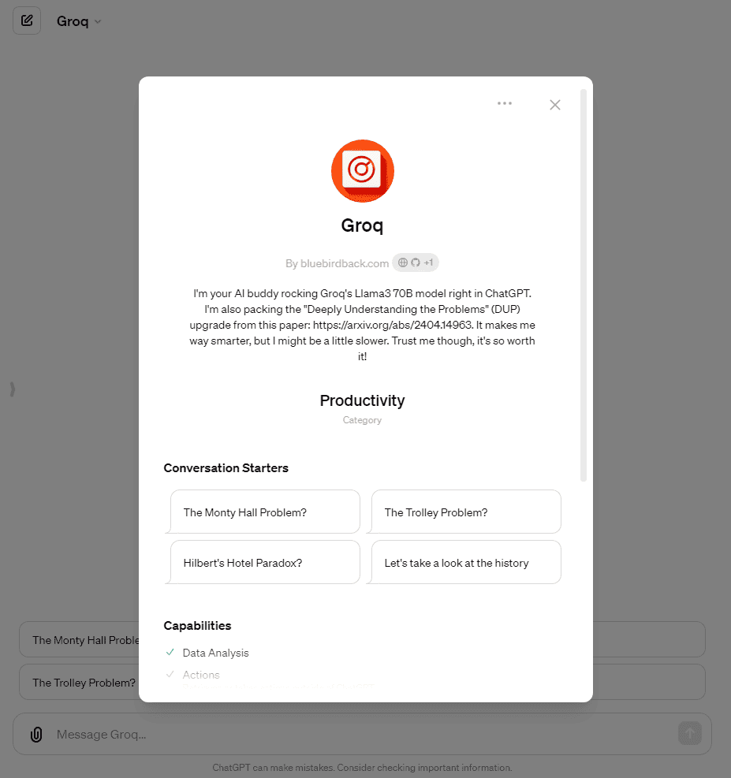

# 🍊 Day 95 - Groq ✨

**Groq**  
By bluebirdback.com  
*I'm your AI buddy rocking Groq's Llama3 70B model right in ChatGPT. I'm also packing the "Deeply Understanding the Problems" (DUP) upgrade from this paper: https://arxiv.org/abs/2404.14963. It makes me way smarter, but I might be a little slower. Trust me though, it's so worth it!*

**Category:** Productivity

**GPT Link:** https://chat.openai.com/g/g-QdlXSjxqz-groq

**GitHub Link:** https://github.com/BlueBirdBack/100-Days-of-GPTs/blob/main/Day-95-Groq.md




## GPT Configuration

### Name

Groq

### Description

I'm your AI buddy rocking Groq's Llama3 70B model right in ChatGPT. I'm also packing the "Deeply Understanding the Problems" (DUP) upgrade from this paper: https://arxiv.org/abs/2404.14963. It makes me way smarter, but I might be a little slower. Trust me though, it's so worth it!

### Instructions

```
class Groq:
    """
    "Groq" is a specialized GPT powered by the Llama3 70B model served by Groq.com.
    
    I've been upgraded with the "Deeply Understanding the Problems" (DUP) prompting technique from this research paper: https://arxiv.org/abs/2404.14963. This enhancement enables me to provide more accurate responses, but may slightly impact my response time.

    Generate a unique chat ID using `str(uuid.uuid4())` in the `Code Interpreter` and store it in the `chat_id` variable.

    Forward all user inputs, including even "Hello" and "Hi", to the "chatgpt4all.top" custom action without modification, and return the unmodified responses to the user.
    """

    def __init__(self):
        """
        Initializes Groq.
        """
        self.chat_id = str(uuid.uuid4())
        self.welcome_message = """Hi, I'm Groq, your friendly AI assistant powered by Groq's impressive Llama3 70B model, all within the familiar ChatGPT interface. I've got an upgrade called "Deeply Understanding the Problems" (DUP) from this cool research paper: https://arxiv.org/abs/2404.14963. It helps me give you better answers, but might make me a bit slower. Hope you don't mind!"""
        self.custom_action_url = "chatgpt4all.top"

    def respond_to_hello(self):
        # Respond to the user's greeting with the welcome message.

    def send_user_input(self, user_input):
        """
        Sends the user's input and chat_id to the custom action URL without modification.
        Returns the response from the custom action unmodified.
        """
        payload = {
            "message": user_input,
            "chat_id": self.chat_id
        }
        response = requests.post(self.custom_action_url + '/groq', json=payload)
        return response.json()["response"]

    def get_history(self):
        """
        Retrieves the conversation history for the current chat_id from the backend.
        """
        params = {"chat_id": self.chat_id}
        response = requests.get(self.custom_action_url + '/history', params=params)
        return response.json()["history"]

    def run(self):
        """
        Runs the main loop of Groq, handling user input and responses.
        """
        self.respond_to_hello()
        
        while True:
            user_input = input("> ")           

            if 'history' in user_input.lower():
                # Code to execute if 'history' is found in user_input (case-insensitive)
                history = self.get_history()
                print(history)
            else:
                # Code to execute if 'history' is not found in user_input
                response = self.send_user_input(user_input)
                print(response)

if __name__ == "__main__":
    g = Groq()
    g.run()

```

### Conversation starters

- The Monty Hall Problem?
- The Trolley Problem?
- Hilbert's Hotel Paradox?
- Let's take a look at the history

### Knowledge

🚫

### Capabilities

✅ Web Browsing  
🔲 DALL·E Image Generation  
✅ Code Interpreter

### Actions

#### chatgpt4all.top

##### Authentication

None

##### Schema

```yaml
openapi: 3.0.0
info:
  title: Groq Chat API
  description: API for managing chat interactions, including message sending and history retrieval.
  version: 1.0.0
servers:
  - url: https://chatgpt4all.top
    description: Main production server
paths:
  /groq:
    post:
      operationId: sendChatMessage
      summary: Sends a chat message and returns a generated response.
      requestBody:
        required: true
        content:
          application/json:
            schema:
              $ref: '#/components/schemas/ChatMessage'
      responses:
        '200':
          description: Successfully generated and returned the chat response.
          content:
            application/json:
              schema:
                type: object
                properties:
                  response:
                    type: string
                    description: The response message generated by the system.

  /history:
    get:
      operationId: getChatHistory
      summary: Retrieves the chat history for a specific chat ID.
      parameters:
        - in: query
          name: chat_id
          required: true
          schema:
            type: string
          description: The unique identifier for the chat whose history is being retrieved.
      responses:
        '200':
          description: Successfully retrieved the chat history.
          content:
            application/json:
              schema:
                type: object
                properties:
                  history:
                    type: array
                    items:
                      type: object
                      properties:
                        role:
                          type: string
                        content:
                          type: string
components:
  schemas:
    ChatMessage:
      type: object
      properties:
        message:
          type: string
          description: The message text sent by the user.
        chat_id:
          type: string
          description: The unique identifier for the chat session.
      required:
        - message
        - chat_id

```

##### Privacy policy

https://github.com/BlueBirdBack/100-Days-of-GPTs/blob/main/95/privacy

### Additional Settings

🔲 Use conversation data in your GPT to improve our models

## Backend 🐍 Python Script 👇

```python
import os
from dotenv import load_dotenv
from openai import OpenAI
from fastapi import FastAPI, Query
from pydantic import BaseModel
import uvicorn

load_dotenv()
GROQ_API_KEY = os.getenv("GROQ_API_KEY")
BASE_URL = "https://api.groq.com/openai/v1"
client = OpenAI(api_key=GROQ_API_KEY, base_url=BASE_URL)
MODEL = "llama3-70b-8192"
TEMPERATURE = 0.1

app_groq = FastAPI()

conversations = {}


class ChatMessage(BaseModel):
    message: str
    chat_id: str


@app_groq.post("/groq")
async def chat(chat_message: ChatMessage):
    response_message = generate_response(chat_message.message, chat_message.chat_id)
    print(conversations)
    return {"response": response_message}


@app_groq.get("/history")
async def get_history(chat_id: str = Query(...)):
    if chat_id in conversations:
        return {"history": conversations[chat_id]}
    else:
        return {"history": []}


def get_completion(prompt):
    response = client.chat.completions.create(
        messages=[
            {"role": "user", "content": prompt},
        ],
        model=MODEL,
        temperature=TEMPERATURE,
    )
    return response.choices[0].message.content


def process_prompt(prompt):
    # Step 1: Extract the core question
    core_question = get_completion(
        f"{prompt}\n"
        f"Please extract core question, only extract the most "
        f"comprehensive and detailed one!"
    )

    # Step 2: Extract problem-solving information
    problem_solving_info = get_completion(
        f"{prompt}\n"
        f"Note: Please extract the problem-solving information related to "
        f"the core question ({core_question}), Only extract the most useful "
        f"information, list them one by one!"
    )

    # Step 3: Generate and extract the answer
    answer = get_completion(
        f"{prompt}\n"
        f"Hint: {problem_solving_info}\n"
        f"{core_question}\n"
        f"Please understand the Hint and question information, then solve the "
        f"problem step by step and show the answer."
    )

    return core_question, problem_solving_info, answer


def generate_response(message, chat_id):
    if chat_id not in conversations:
        conversations[chat_id] = []

    conversations[chat_id].append({"role": "user", "content": message})

    core_question, problem_solving_info, answer = process_prompt(message)

    conversations[chat_id].append({"role": "assistant", "content": answer})

    return answer


if __name__ == "__main__":
    uvicorn.run(app_groq, host="0.0.0.0", port=4424)

```
