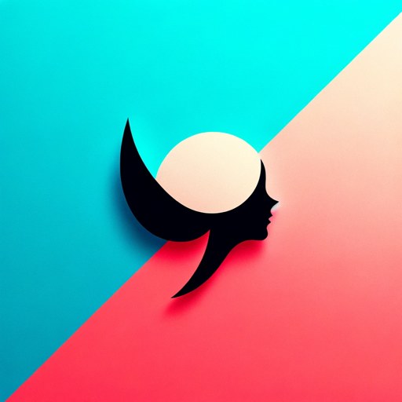

# 100 Days of GPTs

| Day  | Profile Image                                                | Name                                              | Description                                     |
| ---- | ------------------------------------------------------------ | ------------------------------------------------- | ----------------------------------------------- |
| 1    |  | [AbbreviationGPT](./Day-1-AbbreviationGPT.md)     | Specializes in abbreviations and their meanings |
| 2    |  | [AntonymGPT](./Day-2-AntonymGPT.md)               | Generates antonyms for user inputs.             |
| 3    |  | [Synonym Suggester](./Day-3-Synonym-Suggester.md) | A synonym suggestion tool for user inputs       |
| 4    |  | [Global Rankings](./Day-4-Global-Rankings.md)     | Ranks websites globally                         |
| 5    |  | [EmojiGPT](./Day-5-EmojiGPT.md)                   | Suggests emojis for each user input             |
| 6    |  | [NameGPT](./Day-6-NameGPT.md) *remastered*        | I suggest creative GPT names.                   |
| 7    |  | [DescriptionGPT](./Day-7-DescriptionGPT.md)       | I craft concise descriptions for your GPTs.     |
| 8    |  | [Profile Pixie](./Day-8-Profile-Pixie.md)         | I craft profile pictures that speak your GPT.   |

