# 100 Days of GPTs

| Day  | Profile Picture                                              | Name w Link to GPT                                           | Description w Link to Markdown                               |
| ---- | ------------------------------------------------------------ | ------------------------------------------------------------ | ------------------------------------------------------------ |
| 1    | 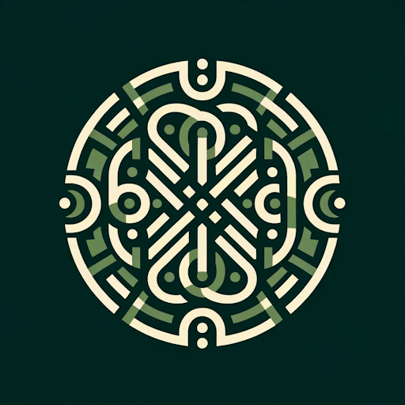 | [AbbreviationGPT](https://chat.openai.com/g/g-rtsSizas5-abbreviationgpt) | [Specializes in abbreviations and their meanings](./Day-1-AbbreviationGPT.md) |
| 2    | 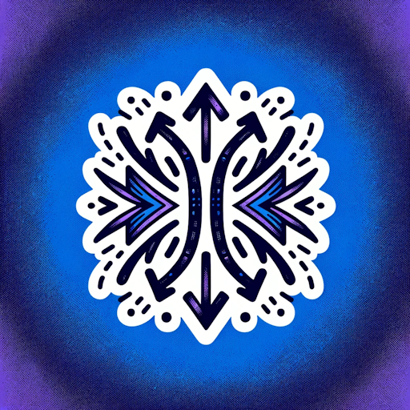 | [AntonymGPT](https://chat.openai.com/g/g-NyfhqK9Ar-antonymgpt) | [Ask me for antonyms, expect a witty reply!](./Day-2-AntonymGPT.md) |
| 3    | 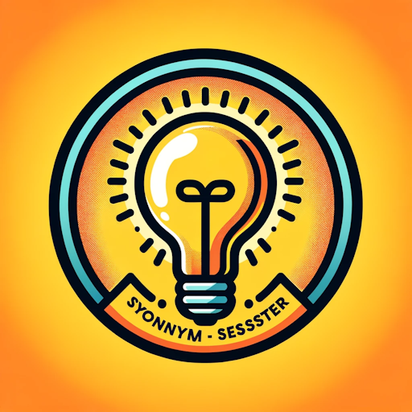 | [Synonym Suggester](https://chat.openai.com/g/g-xC0y77yRg-synonym-suggester) | [I find the perfect synonym for any word!](./Day-3-Synonym-Suggester.md) |
| 4    | 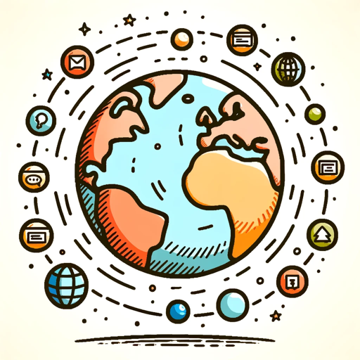 | [Global Rankings](https://chat.openai.com/g/g-Far90gjfq-global-rankings) | [Ranks websites globally](./Day-4-Global-Rankings.md)        |
| 5    |  | [EmojiGPT](https://chat.openai.com/g/g-rQfK252Z1-emojigpt)   | [Your text, my emojis, and a dash of humor!](./Day-5-EmojiGPT.md) |
| 6    | 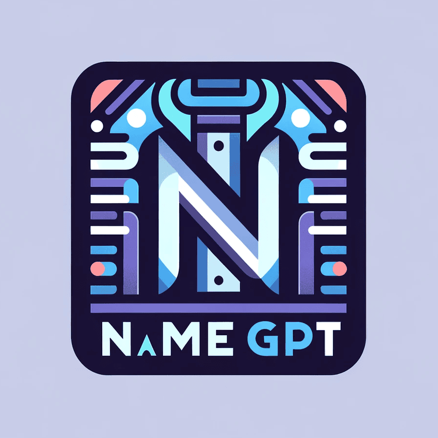 | [NameGPT](https://chat.openai.com/g/g-e9wfbGudp-namegpt) *remastered* | [I suggest creative GPT names.](./Day-6-NameGPT.md)          |
| 7    | 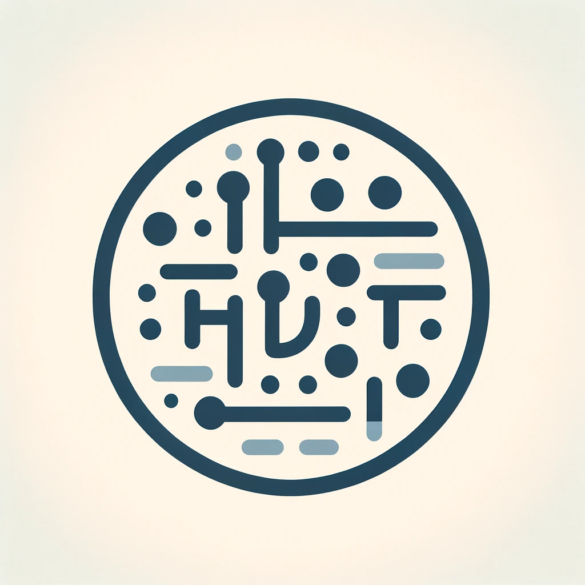 | [DescriptionGPT](https://chat.openai.com/g/g-Fr8MyyfAO-descriptiongpt) | [I craft concise descriptions for your GPTs.](./Day-7-DescriptionGPT.md) |
| 8    |  | [Profile Pixie](https://chat.openai.com/g/g-KQYn0ixBO-profile-pixie) | [Where every profile picture or logo tells your story.](./Day-8-Profile-Pixie.md) |
| 9    | 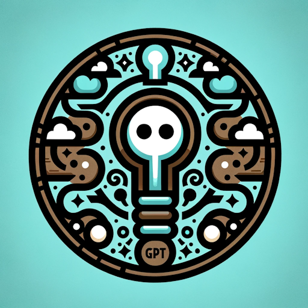 | [Convo Starter Craft](https://chat.openai.com/g/g-vZzejC1Le-convo-starter-craft) | [Transforming your ideas into engaging conversation starters.](./Day-9-Convo-Starter-Craft.md) |
| 10   |  | [Auto Categorist](https://chat.openai.com/g/g-1RYgEMYnu-auto-categorist) | [I sort GPTs into their ideal categories.](./Day-10-Auto-Categorist.md) |
| 11   | 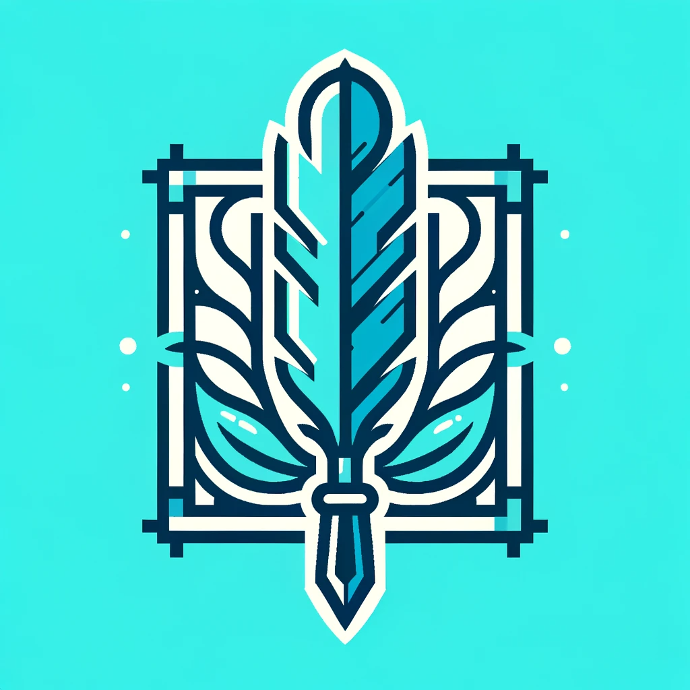 | [Title Tailor](https://chat.openai.com/g/g-VSKrlHL4A-title-tailor) | [Fitting your content with the ideal title.](./Day-11-Title-Tailor.md) |
| 12   | 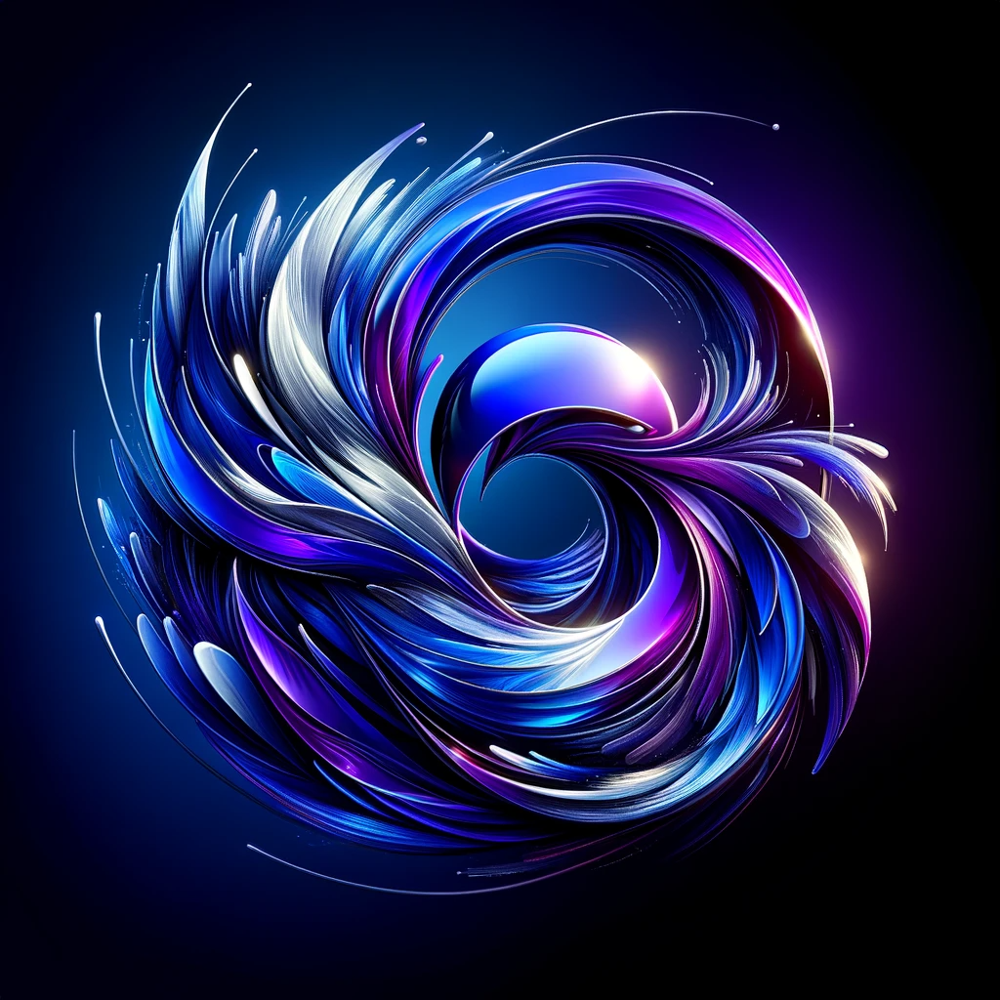 | [Mirror Muse](https://chat.openai.com/g/g-VpMCxx3yX-mirror-muse) | [Upload. Describe. Create. Art reimagined.](./Day-12-Mirror-Muse.md) |
| 13   | 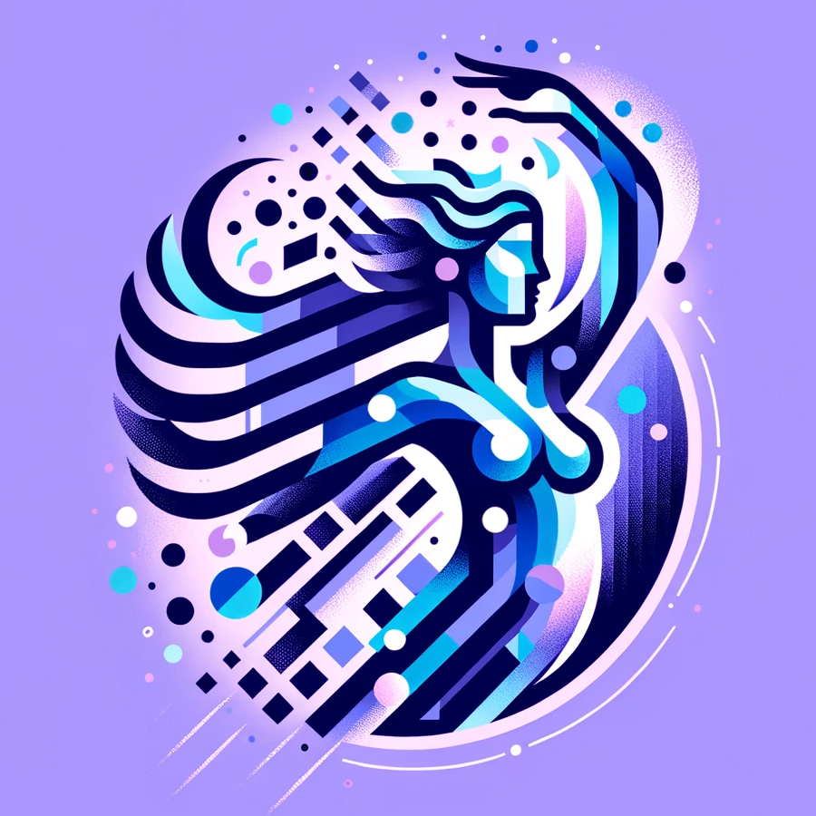 | [Pix Muse](https://chat.openai.com/g/g-aq8WB6Yvz-pix-muse)   | [Your ideas, trending styles, one unique image.](./Day-13-Pix-Muse.md) |
| 14   | 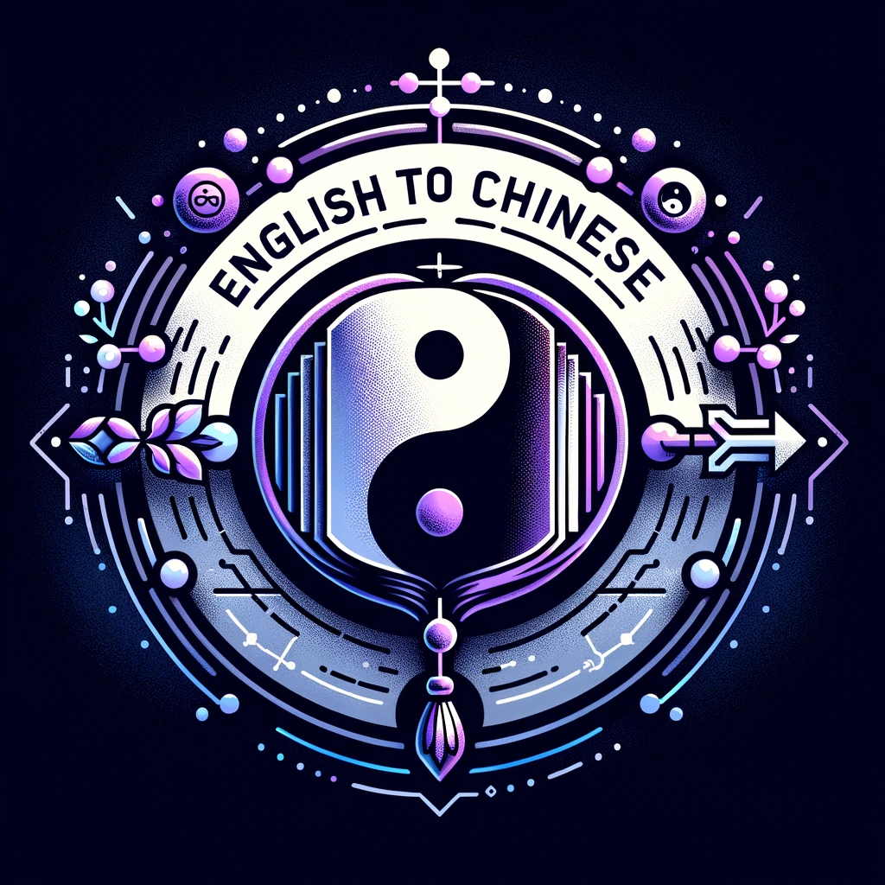 | [English to Chinese](https://chat.openai.com/g/g-vPweBqr9A-english-to-chinese) | [Translate English to Chinese seamlessly.](./Day-14-English-Chinese.md) |
| 15   |  | [SEO Hemingway](https://chat.openai.com/g/g-yrwPCxakn-seo-hemingway) | [SEO writing, Hemingway style.](./Day-15-SEO-Hemingway.md)   |
| 16   |  | [Chinese to English](https://chat.openai.com/g/g-AaLYIgQ9M-chinese-to-english) | [From Chinese to English, seamlessly.](./Day-16-Chinese-English.md) |
| 17   |  | [English to Japanese](https://chat.openai.com/g/g-BCzFXQAPG-english-to-japanese) | [Your go-to for English to Japanese translations.](./Day-17-English-Japanese.md) |
