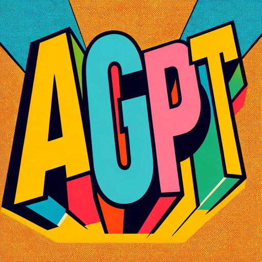

# 100 Days of GPTs

## [Day 1 - AbbreviationGPT](./Day-1-AbbreviationGPT.md)

 Specializes in abbreviations and their meanings

## [Day 2 - AntonymGPT](./Day-2-AntonymGPT)

 Generates antonyms for user inputs.
