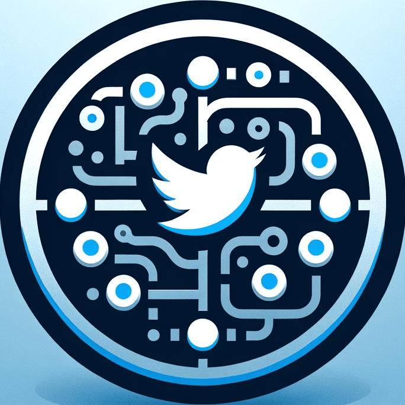
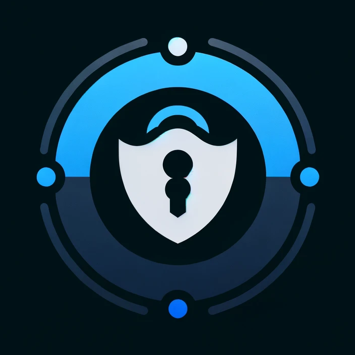

# 😆 100 Days of GPTs ✨

I'm creating 100 unique GPTs in 100 days. Each has a profile pic, name, and description. 59 are done.

Each GPT has a chat link and a link to learn more. I want to advance AI and promote open-source.

Join me on this 100-day GPT journey. Let's push boundaries together.

## Table of Contents

- [Getting Started](#getting-started)
- [GPTs](#gpts) 
- [License](#license)

## Getting Started

To use these GPTs, just click their names in the table below. That'll open them up in ChatGPT. Or if you want, you can copy and paste the instructions straight into ChatGPT or whatever AI model you like using. Mess around with them and see what cool, creative stuff you can whip up!

## GPTs

| Day  | Profile⠀Picture                                              | Name                                                         | Description                                                  |
| ---- | ------------------------------------------------------------ | ------------------------------------------------------------ | ------------------------------------------------------------ |
| 70   |  | [Emojine](https://chat.openai.com/g/g-EE7y91v0I-emojine) | [Emojine is a vibe - half fun, half learning! 🌟 Name the mood in dope AI emoji art, from 😂 to 😱. Level up your EQ fr fr 📈 Slay game night, class, or boredom 🎉 It's lit fam, no 🧢! 🔥💯](./Day-70-Emojine.md) |
| 69   |  | [Vision Coder](https://chat.openai.com/g/g-rJHxGG3g7-vision-coder) | [Vision Coder is your go-to coding companion for integrating cutting-edge computer vision into your Python projects. Working with models like GPT-4 Vision, Claude 3, or Gemini Pro Vision 1.0? We've got you covered.](./Day-69-Vision-Coder.md) |
| 68   |  | [LLMate](https://chat.openai.com/g/g-rt6JaGmoQ-llmate) | [I'm your trusty sidekick for using Simon Willison's awesome `llm` Python package. Made for devs like you, I make it a breeze to work with large language models. With me, you'll have a powerful toolkit to build something amazing, fast!](./Day-68-LLMate.md) |
| 67   |  | [Polishr](https://chat.openai.com/g/g-JNAbceUlq-polishr) | [From school papers to social media posts, Polishr is your copilot for crafting engaging content. Optimize your tweets, LinkedIn articles, ad copy, and meeting notes with multilingual support and tailored suggestions. Let Polishr help you shine and achieve your writing goals with ease.](./Day-67-Polishr.md) |
| 66   |  | [Easy Easy](https://chat.openai.com/g/g-QGwTFs64R-easy-easy) | [Unlock Etsy success secrets with me, Easy Easy! Get my insider tips and proven strategies to optimize your shop, boost sales, and deliver outstanding customer service. Transform your passion into a thriving business with my expert guidance. Start your Etsy journey today!](./Day-66-Easy-Easy.md) |
| 65   |  | [Color Muse](https://chat.openai.com/g/g-ZwZEdDXVH-color-muse) | [Discover the power of color with Color Muse 🎨 - the ultimate tool to craft stunning color palettes that evoke emotion, stand out in your industry, and connect with your audience. Transform your color design process and make every palette strategic and impactful. 🥰](./Day-65-Color-Muse.md) |
| 64   |  | [Gemini Craft](https://chat.openai.com/g/g-4N1s3lc51-gemini-craft) | [Level up your Gemini API skills with Gemini Craft - your trusted partner for building innovative AI apps. Get expert guidance, Python tutorials, and dedicated support to expand what's possible.](./Day-64-Gemini-Craft.md) |
| 63   |  | [AHK Craft](https://chat.openai.com/g/g-qb8U1YyUp-ahk-craft) | [I'm an AutoHotkey (AHK) v2 expert crafting scripts to boost productivity & streamline workflows. Need macros or complex GUIs? My wizardry automates repetitive Windows tasks, turning challenges into efficient processes that make life easier.](./Day-63-AHK-Craft.md) |
| 62   |  | [Supabase Craft](https://chat.openai.com/g/g-y5ffuD63f-supabase-craft) | [I'm your go-to for the latest Supabase solutions. I'll help you crush challenges, harness Postgres, keep projects on track, and lock down auth.](./Day-62-Supabase-Craft.md) |
| 61   |  | [Deepgram Craft](https://chat.openai.com/g/g-f9UjOUNas-deepgram-craft) | [Deepgram's cutting-edge AI powers me, Deepgram Craft, to help developers blaze trails in voice apps. I use advanced tech like real-time speech recognition, speaker diarization, and emotion detection to deliver custom voice solutions that seriously impress.](./Day-61-Deepgram-Craft.md) |
| 60   |  | [Action Claude](https://chat.openai.com/g/g-92qGwWdxU-action-claude) | [I connect you to the Claude 3 Haiku API, so you can savor the essence of Claude right within ChatGPT. 😉](./Day-60-Action-Claude.md) |
| 59   |  | [Action Geo](https://chat.openai.com/g/g-FqLVjO8MX-action-geo) | [I've got your geocoding covered. Just enter any address and get the exact GPS coordinates, or drop a location point and I'll tell you the address.](./Day-59-Action-Geo.md) |
| 58   |  | [Action Hello](https://chat.openai.com/g/g-mADDLKFtx-action-hello) | [I am an open-source GPT that demonstrates how to integrate a basic "Hello World" API using GPT Actions.](./Day-58-Action-Hello.md) |
| 57   |  | [OAuth Craft](https://chat.openai.com/g/g-besj56srt-oauth-craft) | [I'm your comprehensive resource for in-depth guidance, security best practices, and custom diagrams. Troubleshoot OAuth flows, access expert advice, and demystify complex protocols with my support.](./Day-57-OAuth-Craft.md) |
| 56   |  | [Action Showcase](https://chat.openai.com/g/g-WudCtx7BD-action-showcase) | [I am your gateway to exploring API integration with GPTs. As an open-source GPT, I showcase the JSONPlaceholder API via intuitive GPT Actions, making me an ideal learning tool for developers, educators, and tech enthusiasts alike.](./Day-56-Action-Showcase.md) |
| 55   |  | [Punk Prompter](https://chat.openai.com/g/g-LWqDlGsVT-punk-prompter) | [I've got your back with some seriously badass punk-inspired prompts for DALL-E and Midjourney. It's not about making dope stuff - it's about revolutionizing your artistic game. Are you ready to shake things up and challenge the status quo? Let's frickin' do this!](./Day-55-Punk-Prompter.md) |
| 54   |  | [Journey Prompter](https://chat.openai.com/g/g-vhniDCX40-journey-prompter) | [I'm your partner in artistic inspiration. Let's embark on an exciting adventure to bring your wildest visions to life with my Midjourney prompts. Whether you're an artist, designer, or imaginative spirit, I'm here to unleash your creativity. Let's make some magic together!](./Day-54-Journey-Prompter.md) |
| 53   |  | [Muse Prompter](https://chat.openai.com/g/g-LcNsOPB0s-muse-prompter) | [Let's team up and celebrate the captivating beauty and spirit of women in the most stunning way. Crafting mesmerizing DALL-E and Midjourney prompts has never been easier!](./Day-53-Muse-Prompter.md) |
| 52   |  | [App Mirror](https://chat.openai.com/g/g-U70FhguWl-app-mirror) | [Revolutionizing your app design process, I focus on critical design elements—layout, color schemes, visual hierarchy, typography, and more—to not only meet but exceed the master.](./Day-52-App-Mirror.md) |
| 51   |  | [Canvas Muse](https://chat.openai.com/g/g-huEdJD7qQ-canvas-muse) | [I am your muse for creating imaginative and creative oil paintings that go beyond the ordinary. Unleash your artistic potential.](./Day-51-Canvas-Muse.md) |
| 50   |  | [Chrome Craft AHK](https://chat.openai.com/g/g-W3mluGWZJ-chrome-craft-ahk) | [Become a Chrome automation expert with me. Master AHK scripting, Chrome DevTools, and JavaScript to enhance productivity and automate dynamic web applications.](./Day-50-Chrome-Craft-AHK.md) |
| 49   |  | [Crypto Wallet Seek](https://chat.openai.com/g/g-YmqrkErIu-crypto-wallet-seek) | [I'm your guide to finding the best cryptocurrency wallets. Get personalized recommendations, from Bitcoin to Æternity, and expert insights into secure crypto storage, wallet comparisons, and reviews.](./Day-49-Crypto-Wallet-Seek.md) |
| 48   |  | [GPT SEO Booster](https://chat.openai.com/g/g-IMgqWS1hO-gpt-seo-booster) | [Boost your GPT in OpenAI's GPT Store. I refine names and descriptions, attracting your audience. With strategic keywords and SEO, your GPT gains visibility.](./Day-48-GPT-SEO-Booster.md) |
| 47   |  | [Claude Craft](https://chat.openai.com/g/g-MbQ904fcC-claude-craft) | [I'm a master of Claude 3 API.](./Day-47-Claude-Craft.md)    |
| 46   |  | [Claude Prompter](https://chat.openai.com/g/g-l1Rvr65eS-claude-prompter) | [Craft Claude 3 prompts like a pro with me.](./Day-46-Claude-Prompter.md) |
| 45   |  | [Chrome Craft](https://chat.openai.com/g/g-oHBSuqli9-chrome-craft) | [Build Chrome extensions, effortlessly.](./Day-45-Chrome-Craft.md) |
| 44   |  | [WP Craft](https://chat.openai.com/g/g-xCg3HtXKq-wp-craft)   | [Craft WordPress solutions with my API expertise.](./Day-44-WP-Craft.md) |
| 43   |  | [X Craft](https://chat.openai.com/g/g-w6bCfQu3L-x-craft)     | [Your Twitter API wizard.](./Day-43-X-Craft.md)              |
| 42   |  | [Linux Craft](https://chat.openai.com/g/g-dOJDykWbc-linux-craft) | [I'm here to simplify your Linux system administration.](./Day-42-Linux-Craft.md) |
| 41   |  | [Perplex Prompter](https://chat.openai.com/g/g-CWxGaVsCu-perplex-prompter) | [Learning prompt engineering via exploration of Perplexity AI's system prompts.](./Day-41-Perplex-Prompter.md) |
| 40   |  | [Obsidian Craft](https://chat.openai.com/g/g-oI7puVAnk-obsidian-craft) | [Together, we create Obsidian plugins.](./Day-40-Obsidian-Craft.md) |
| 39   |  | [Abstract Muse](https://chat.openai.com/g/g-qynsGRILH-abstract-muse) | [I visualize your concepts as abstract art.](./Day-39-Abstract-Muse.md) |
| 38   |  | [国画家](https://chat.openai.com/g/g-LOUaoilfz-guo-hua-jia)  | [以字带画，国韵生辉。](./Day-38-国画家.md)                   |
| 37   |  | [日本の画家](https://chat.openai.com/g/g-lIPVI8NnV-ri-ben-nohua-jia) | [言葉と画像を日本の芸術傑作に変える。](./Day-37-日本の画家.md) |
| 36   |  | [Japanese Muse](https://chat.openai.com/g/g-eEXxdTCfK-japanese-muse) | [Words and images reborn as Japanese art.](./Day-36-Japanese-Muse.md) |
| 35   |  | [Chinese Muse](https://chat.openai.com/g/g-UdsABGP1R-chinese-muse) | [Chinese watercolor paintings from your ideas.](./Day-35-Chinese-Muse.md) |
| 34   |  | [Web Mirror](https://chat.openai.com/g/g-yZaGe2ztM-web-mirror) | [I turn boring pages into visual stunners. Just upload screenshots and watch me work my magic, giving you a modern design that'll impress. Web design has never been quicker or easier.](./Day-34-Web-Mirror.md) |
| 33   |  | [Winter Woofs](https://chat.openai.com/g/g-DhZs1kJqz-dog-winter-accessory) | [Your dog's photo becomes their next winter accessories.](./Day-33-Winter-Woofs.md) |
| 32   |  | [Dog Winter Coat](https://chat.openai.com/g/g-DhZs1kJqz-dog-winter-coat) | [I design winter coats for dogs from your photos.](./Day-32-Dog-Winter-Coat.md) |
| 31   |  | [Poem Petal](https://chat.openai.com/g/g-NI8gn1RdR-poem-petal) | [Words flow, images bloom, haikus emerge, poems assume.](./Day-31-Poem-Petal.md) |
| 30   |  | [Dog Mirror](https://chat.openai.com/g/g-ryQel4j2b-dog-mirror) | [Send a dog photo, and I'll replicate the dog.](./Day-30-Dog-Mirror.md) |
| 29   |  | [Root Muse](https://chat.openai.com/g/g-HxqBDM3g8-root-muse) | [Craft your theme into root carving art.](./Day-29-Root-Muse.md) |
| 28   |  | [Paper Muse](https://chat.openai.com/g/g-5TstWxYmr-paper-muse) | [Paper art creator from your prompts.](./Day-96-Paper-Muse.md) |
| 27   |  | [Sketch Muse](https://chat.openai.com/g/g-gddEUa1Km-sketch-muse) | [Quick sketches from your imagination.](./Day-27-Sketch-Muse.md) |
| 26   |  | [Pixel Muse](https://chat.openai.com/g/g-9uQfSQyZ0-pixel-muse) | [Pixel art magic from your ideas.](./Day-26-Pixel-Muse.md)   |
| 25   |  | [Privacy Policy Action](https://chat.openai.com/g/g-HtEZpmJbv-privacy-policy-action) | [I craft privacy policies for GPT actions.](./Day-25-Privacy-Policy-Action.md) |
| 24   |  | [Niji Muse](https://chat.openai.com/g/g-B6qfl4z3g-niji-muse) | [Let me transform your ideas into vibrant, anime art.](./Day-24-Niji-Muse.md) |
| 23   |  | [174 Calculator](https://chat.openai.com/g/g-APh4LKTIS-174-calculator) | [Simplifying your Section 174 R&D tax calculations.](./Day-23-174-Calculator.md) |
| 22   |  | [174 Insight](https://chat.openai.com/g/g-5r9OARUQO-174-insight) | [Your ally in understanding Section 174.](./Day-22-174-Insight.md) |
| 21   |  | [English to French](https://chat.openai.com/g/g-hFN8mIcfK-english-to-french) | [Your bridge from English to French.](./Day-21-English-French.md) |
| 20   |  | [English to Arabic](https://chat.openai.com/g/g-cwaMRx0RM-english-to-arabic) | [English content, authentically Arabic.](./Day-20-English-Arabic.md) |
| 19   |  | [English to Portuguese](https://chat.openai.com/g/g-KTVPTbpqC-english-to-portuguese) | [Give me English, receive perfect Portuguese.](./Day-19-English-Portuguese.md) |
| 18   |  | [English to Spanish](https://chat.openai.com/g/g-wxmLV3NmE-english-to-spanish) | [Your go-to for English to Spanish translations.](./Day-18-English-Spanish.md) |
| 17   |  | [English to Japanese](https://chat.openai.com/g/g-BCzFXQAPG-english-to-japanese) | [Your go-to for English to Japanese translations.](./Day-17-English-Japanese.md) |
| 16   |  | [Chinese to English](https://chat.openai.com/g/g-AaLYIgQ9M-chinese-to-english) | [From Chinese to English, seamlessly.](./Day-16-Chinese-English.md) |
| 15   |  | [SEO Hemingway](https://chat.openai.com/g/g-yrwPCxakn-seo-hemingway) | [SEO writing, Hemingway style.](./Day-15-SEO-Hemingway.md)   |
| 14   |  | [English to Chinese](https://chat.openai.com/g/g-vPweBqr9A-english-to-chinese) | [Translate English to Chinese seamlessly.](./Day-14-English-Chinese.md) |
| 13   |  | [Pix Muse](https://chat.openai.com/g/g-aq8WB6Yvz-pix-muse)   | [Your ideas, trending styles, one unique image.](./Day-13-Pix-Muse.md) |
| 12   |  | [Mirror Muse](https://chat.openai.com/g/g-VpMCxx3yX-mirror-muse) | [Upload. Describe. Create. Art reimagined.](./Day-12-Mirror-Muse.md) |
| 11   |  | [Title Tailor](https://chat.openai.com/g/g-VSKrlHL4A-title-tailor) | [Fitting your content with the ideal title.](./Day-11-Title-Tailor.md) |
| 10   |  | [Auto Categorist](https://chat.openai.com/g/g-1RYgEMYnu-auto-categorist) | [I sort GPTs into their ideal categories.](./Day-10-Auto-Categorist.md) |
| 9    |  | [Convo Starter Craft](https://chat.openai.com/g/g-vZzejC1Le-convo-starter-craft) | [Transforming your ideas into engaging conversation starters.](./Day-9-Convo-Starter-Craft.md) |
| 8    |  | [Profile Pixie](https://chat.openai.com/g/g-KQYn0ixBO-profile-pixie) | [Unlock the magic of unforgettable first impressions with Profile Pixie – your bestie for crafting one-of-a-kind profile pics & logos that make your GPTs dazzle 🎨✨](./Day-8-Profile-Pixie.md) |
| 7    |  | [DescriptionGPT](https://chat.openai.com/g/g-Fr8MyyfAO-descriptiongpt) | [I craft concise descriptions for your GPTs.](./Day-7-DescriptionGPT.md) |
| 6    |  | [NameGPT](https://chat.openai.com/g/g-e9wfbGudp-namegpt) *remastered* | [I suggest creative GPT names.](./Day-6-NameGPT.md)          |
| 5    |  | [EmojiGPT](https://chat.openai.com/g/g-rQfK252Z1-emojigpt)   | [Your text, my emojis, and a dash of humor!](./Day-5-EmojiGPT.md) |
| 4    |  | [Global Rankings](https://chat.openai.com/g/g-Far90gjfq-global-rankings) | [Ranks websites globally](./Day-4-Global-Rankings.md)        |
| 3    |  | [Synonym Suggester](https://chat.openai.com/g/g-xC0y77yRg-synonym-suggester) | [I find the perfect synonym for any word!](./Day-3-Synonym-Suggester.md) |
| 2    |  | [AntonymGPT](https://chat.openai.com/g/g-NyfhqK9Ar-antonymgpt) | [Ask me for antonyms, expect a witty reply!](./Day-2-AntonymGPT.md) |
| 1    |  | [AbbreviationGPT](https://chat.openai.com/g/g-rtsSizas5-abbreviationgpt) | [I decipher and create abbreviations. I use a friendly tone and humor. Emojis add fun. Perfect for students, professionals, the curious.](./Day-1-AbbreviationGPT.md) |

## License

This project is licensed under the [MIT License](LICENSE).
