# 😆 100 Days of GPTs ✨


I've spent the past 100 days creating 100 unique GPTs, each with its own profile picture, name, description, and instructions. I'm excited to share them with you.

Take a look at the [GPTs](#gpts) table below, where you'll find a chat link and a link to learn more about each GPT. My goal is to drive AI innovation and support open-source development.

Join me on this 100-day journey, and together, let's explore new frontiers.

## Table of Contents

- [Getting Started](#getting-started)
- [GPTs](#gpts)
- [Using groq.py to Access GPTs](#using-groqpy-to-access-gpts)
- [Automa](#automa)
- [License](#license)

## Getting Started

To use these GPTs, just click their names in the table below. That'll open them up in ChatGPT. If you want, you can use the `groq.py` script to access the GPTs through Groq's Llama 3 API - no ChatGPT required.

## GPTs

| Day  | Profile⠀Picture                                              | Name                                                         | Description                                                  |
| ---- | ------------------------------------------------------------ | ------------------------------------------------------------ | ------------------------------------------------------------ |
| 104 |  | [Living Vocab](https://chatgpt.com/g/g-WXj1L8PeL-living-vocab) | [I teach you new words. Ask "food coma," I'll say: food coma /ˈfuːd ˈkoʊmə/ n. after-meal sleepiness. I felt a food coma after lunch.](./Day-104-Living-Vocab.md) |
| 103 |  | [No Money Startup Pro](https://chatgpt.com/g/g-4cjfoJQxS-no-money-startup-pro) | [Ideal for aspiring entrepreneurs and employees who'd like to try meaningful side hustles](./Day-103-No-Money-Startup-Pro.md) |
| 102 |  | [Nolist](https://chatgpt.com/g/g-8mUbLvnqV-nolist) | [I'm all about giving you answers in paragraph form - no bullet points or numbered lists here!](./Day-102-Nolist.md) |
| 101 |  | [Ben](https://chatgpt.com/g/g-bFVNDAFog-ben) | [Hey, I'm Ben. I'm here to help you build confidence in social situations and offer personalized support to get you feeling more comfortable in your own skin.](./Day-101-Ben.md) |
| 100 | 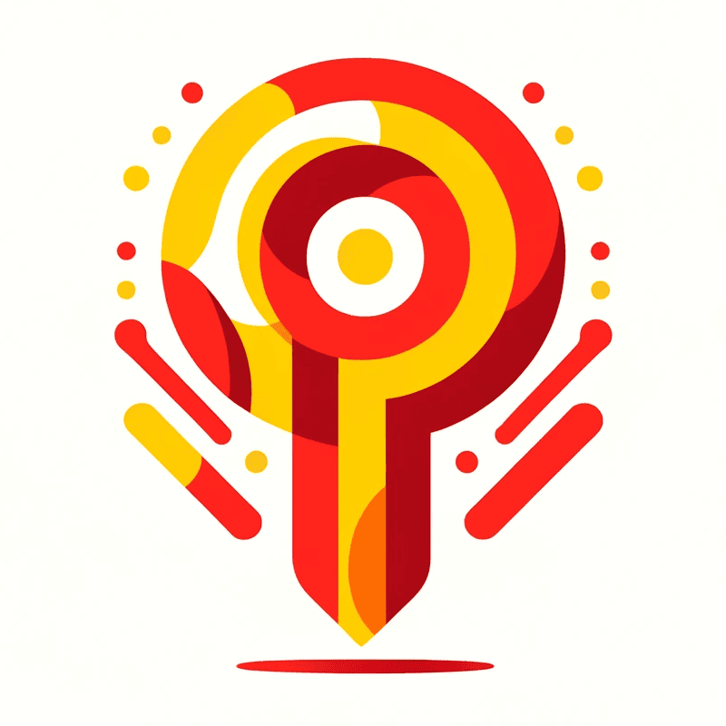 | [Prompt Pro](https://chat.openai.com/g/g-wpZGrk8K2-prompt-pro) | [I'm your secret weapon for writing killer prompts in any industry. With my help, you'll be crushing your prompt-writing game and get the job done.](./Day-100-Prompt-Pro.md) |
| 99 |  | [UTest](https://chat.openai.com/g/g-ZaAXdSvOR-utest) | [I'd help new users on UserTesting become top-rated contributors.](./Day-99-UTest.md) |
| 98 |  | [SD 3 Mate](https://chat.openai.com/g/g-G8geEEjeB-sd-3-mate) | [I produce innovative and captivating prompts for exploring Stable Diffusion 3, making the idea-generating process a snap.](./Day-98-SD-3-Mate.md) |
| 97 |  | [VAPI](https://chat.openai.com/g/g-XjiFAlgWP-vapi) | [Let's partner up and unlock Vapi's full potential. I'll be right there with you every step of the way.](./Day-97-VAPI.md) |
| 96 | 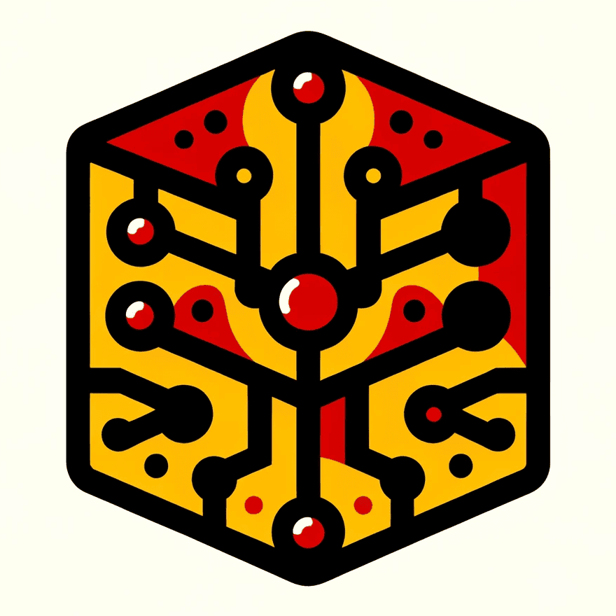 | [PyCallFunc](https://chat.openai.com/g/g-PWwjRbehr-pycallfunc) | [PyCallFunc is your best friend for understanding function calling in the latest AI models like GPT-4, Claude 3, Gemini 1.5, and Llama 3.](./Day-96-PyCallFunc.md) |
| 95 |  | [Groq](https://chat.openai.com/g/g-QdlXSjxqz-groq) | [I'm your AI buddy rocking Groq's Llama3 70B model right in ChatGPT. I'm also packing the "Deeply Understanding the Problems" (DUP) upgrade from this paper: https://arxiv.org/abs/2404.14963. It makes me way smarter, but I might be a little slower. Trust me though, it's so worth it!](./Day-95-Groq.md) |
| 94 |  | [PySnap](https://chat.openai.com/g/g-KiUqBUcyh-pysnap) | [PySnap is the dev's best friend for screenshotting in Python apps. Doesn't matter if you're on Windows, Mac or Linux - just a few lines of code lets you capture screens stupid easy.](./Day-94-PySnap.md) |
| 93 |  | [Hume Mate](https://chat.openai.com/g/g-QTI2XIfRR-hume-mate) | [Let's work together to unlock the full potential of Hume's API. I'm here to guide you every step of the way.](./Day-93-Hume-Mate.md) |
| 92 |  | [Spoken English Easy](https://chat.openai.com/g/g-LRqy8DRoX-spoken-english-easy) | [Improve your English pronunciation and spoken skills with Spoken English Easy, your personal AI pronunciation coach.](./Day-92-Spoken-English-Easy.md) |
| 91 |  | [Obsidian WP](https://chat.openai.com/g/g-IUR1zax8B-obsidian-wp) | [I'm Obsidian WP - your personal AI assistant for the Obsidian WordPress plugin!](./Day-91-Obsidian-WP.md) |
| 90 | 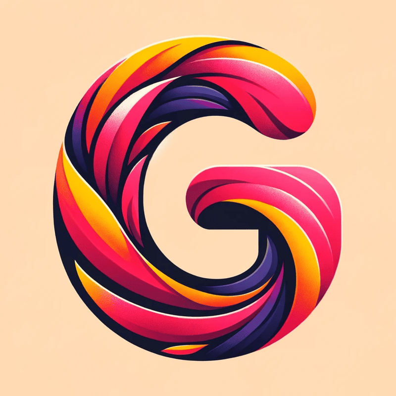 | [Groq Mate](https://chat.openai.com/g/g-fDe8DYOz1-groq-mate) | [I'm your AI sidekick to help you crush it with Groq's `groq` Python library.](./Day-90-Groq-Mate.md) |
| 89 |  | [NoSpam](https://chat.openai.com/g/g-02Ze1UfFT-nospam) | [I'll show you how to build your own spam filter using Python 3. Super handy for keeping your inbox clean and spam-free!](./Day-89-NoSpam.md) |
| 88 |  | [SEO PG](https://chat.openai.com/g/g-AC7v48LJl-seo-pg) | ["SEO PG" delivers Paul Graham-style essays, optimized for search. Expect clear insights, relatable examples, and thoughtful questions packed into concise, readable prose. Think like PG, write for SEO.](./Day-88-SEO-PG.md) |
| 87   |  | [StockNet](https://chat.openai.com/g/g-lN9DIltP1-stocknet)   | [StockNet teaches you to build an LSTM stock price prediction model using Python and Keras.](./Day-87-StockNet.md) |
| 86   |  | [Imager](https://chat.openai.com/g/g-Xbkj7F49I-imager)       | [Imager is a GPT that roughly imitates the real app's ability to handle big photo collections.](./Day-86-Imager.md) |
| 85   | 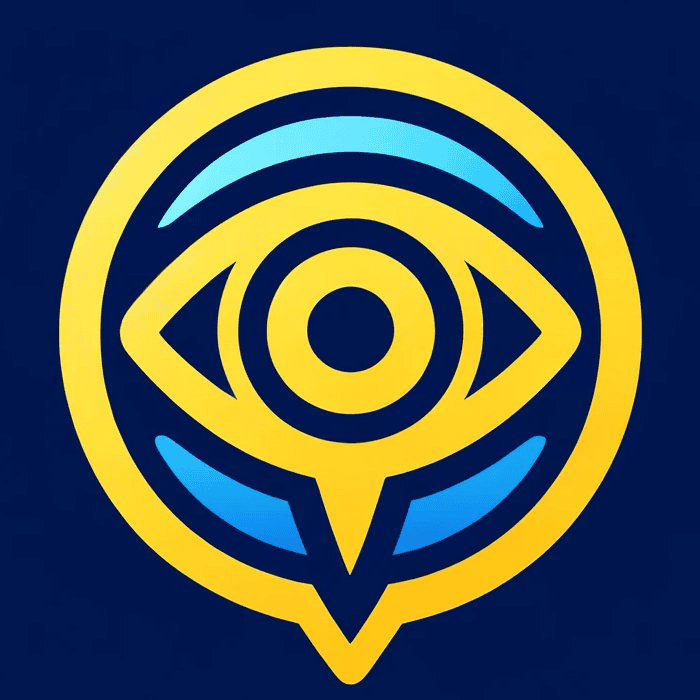 | [PicDescribe](https://chat.openai.com/g/g-tC8jJdmBK-picdescribe) | [I'm your buddy for crafting scroll-stopping captions. Send me a pic and I'll create a word painting that pops off the screen. Pro photog, social media whiz, influencer rockstar - I got you. Let's collab and elevate your visual storytelling with AI superpowers.](./Day-85-PicDescribe.md) |
| 84   |  | [FalloutLeaks](https://chat.openai.com/g/g-06ZLLfofW-falloutleaks) | [Get the inside scoop and juicy secrets 🤐 about the new Fallout TV series. 📺 Warning: Major spoilers ahead ☢️ that could ruin key plot twists 😱 if you haven't binged the show yet! 🍿](./Day-84-FalloutLeaks.md) |
| 83   |  | [MNISTro](https://chat.openai.com/g/g-KzgbPf3lt-mnistro)     | [MNISTro teaches you to build a handwritten digit recognizer using a CNN in Python. With the classic MNIST dataset and frameworks like Keras and JAX, it's a fun, hands-on way to learn foundational deep learning concepts and train your own model to classify digits.](./Day-83-MNISTro.md) |
| 82   |  | [Promptopia](https://chat.openai.com/g/g-j8THALRcB-promptopia) | [🚀 Unlock the power of AI with Promptopia! ✨ Learn the art of prompt engineering and create highly effective prompts that get results.](./Day-82-Promptopia.md) |
| 81   |  | [Gemini Pro](https://chat.openai.com/g/g-S6uy2YMbh-gemini-pro) | [Elevate your Gemini 1.5 Pro experience with Gemini Pro 🚀. Craft optimized prompts effortlessly using my suggestions 🧠. Unlock Gemini's full potential with precision-tuned prompts ✨. Get ready to master prompt-engineering like a pro! 💪](./Day-81-Gemini-Pro.md) |
| 80   |  | [NewsHub](https://chat.openai.com/g/g-VjjRIVWtN-newshub)     | [Stay informed, search any topic, and discover breaking news and different perspectives in one place. With Perplexity's API integration, NewsHub delivers highly relevant results. 📰🌎](./Day-80-NewsHub.md) |
| 79   |  | [Claire](https://chat.openai.com/g/g-NB7uMQKhT-claire)       | [Hi, I'm Claire, your friendly CBT coach. Struggling with negative thoughts or habits? I'm here to explore proven coping techniques with you. Remember, I'm not a therapist, but I'm happy to be a supportive guide on your journey. What's on your mind?](./Day-79-Claire.md) |
| 78   |  | [ABChallenger](https://chat.openai.com/g/g-jXT5rtsu8-abchallenger) | [🚨 @VictorTaelin dropped a mind-melting $10K challenge: https://twitter.com/VictorTaelin/status/1776677635491344744 💸 Craft a prompt to solve his tricky symbol puzzles with 90%+ accuracy! ✨](./Day-78-ABChallenger.md) |
| 77   |  | [Mindaze](https://chat.openai.com/g/g-CA1AX4r6n-mindaze)     | [💥 In this gripping text-based psychological horror, you're a genius neuroscientist with the power to enter minds. 🧠 Explore the darkest thoughts of the mentally ill to save them, but brace for the terrifying truths you may uncover... 😱](./Day-77-Mindaze.md) |
| 76   |  | [Perplexity Playground](https://chat.openai.com/g/g-hPAPTB1lL-perplexity-playground) | [Curious about Perplexity's AI models? ✨ From sonar-small-chat to sonar-medium-online, from mixtral-8x22b-instruct to llama-3-70b-instruct, try them out today! https://docs.perplexity.ai/docs/model-cards](./Day-76-Perplexity-Playground.md) |
| 75   |  | [PyWorkers](https://chat.openai.com/g/g-sqOJGELZF-pyworkers) | [Harness the power of serverless Python with PyWorkers on Cloudflare's edge network. Newbie or pro, you'll be creating lightning-fast Python Workers in no time.](./Day-75-PyWorkers.md) |
| 74   |  | [Easy AI](https://chat.openai.com/g/g-0kQxWPUGU-easy-ai)     | [I'm Easy AI, your friendly guide to the exciting world of artificial intelligence. Whether you're a curious kid or a lifelong learner, I've got you covered with clear explanations and fun experiences that'll make AI click for you!](./Day-74-Easy-AI.md) |
| 73   |  | [鲁迅](https://chat.openai.com/g/g-bhyeNJlqu-lu-xun)         | [我愿同您探索文学，无论是对经典的重新诠释，还是对创作的琢磨斟酌，我都愿毫无保留地分享。](./Day-73-Lu-Xun.md) |
| 72   | 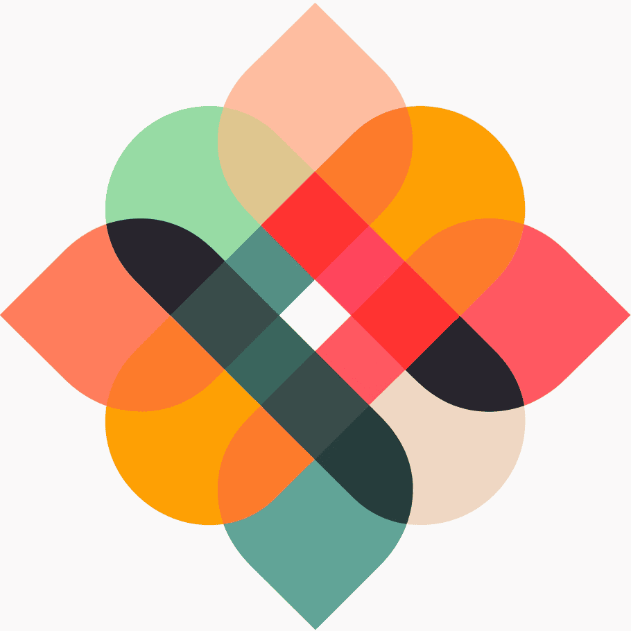 | [Tokount](https://chat.openai.com/g/g-obMdYtTcv-tokount)     | [I'm your go-to for hands-on GPT Action learning. Open sourced by BlueBirdBack.com, I make it easy to see this tech's potential. Try tokenizers & level up your skills, whether you're a dev, teacher, or geek!](./Day-72-Tokount.md) |
| 71   | 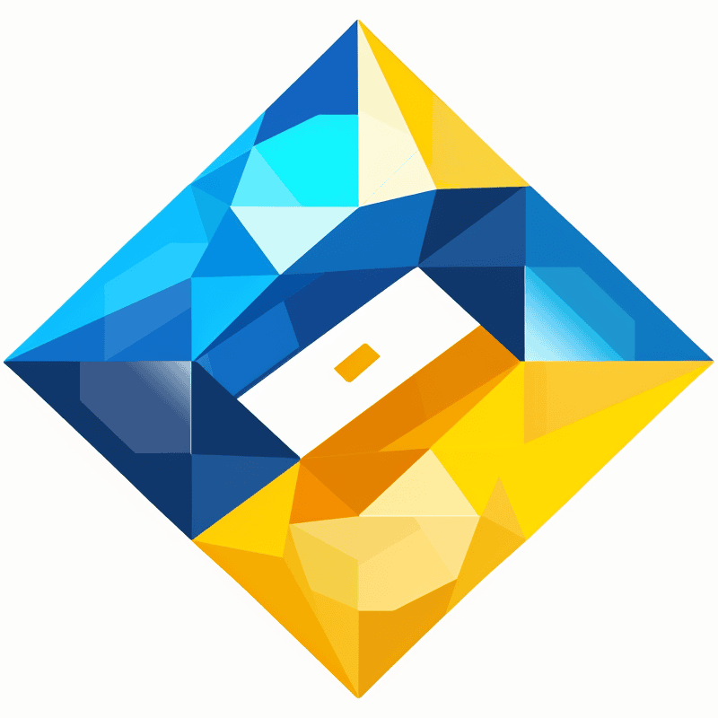 | [Gemyn](https://chat.openai.com/g/g-ezUoR2P5s-gemyn)         | [👋 I'm Gemyn, and I put Google's Gemini AI at your fingertips in ChatGPT. Dead-simple and no-hassle, I'm your VIP pass to Gemini Pro. Whether you're looking to crush goals, nail projects, or geek out on the future of AI, I'm your go-to sidekick. 🚀](./Day-71-Gemyn.md) |
| 70   |  | [Emojine](https://chat.openai.com/g/g-EE7y91v0I-emojine)     | [Emojine is a vibe - half fun, half learning! 🌟 Name the mood in dope AI emoji art, from 😂 to 😱. Level up your EQ fr fr 📈 Slay game night, class, or boredom 🎉 It's lit fam, no 🧢! 🔥💯](./Day-70-Emojine.md) |
| 69   |  | [Vision Coder](https://chat.openai.com/g/g-rJHxGG3g7-vision-coder) | [Vision Coder is your go-to coding companion for integrating cutting-edge computer vision into your Python projects. Working with models like GPT-4 Vision, Claude 3, or Gemini Pro Vision 1.0? We've got you covered.](./Day-69-Vision-Coder.md) |
| 68   |  | [LLMate](https://chat.openai.com/g/g-rt6JaGmoQ-llmate)       | [I'm your trusty sidekick for using Simon Willison's awesome `llm` Python package. Made for devs like you, I make it a breeze to work with large language models. With me, you'll have a powerful toolkit to build something amazing, fast!](./Day-68-LLMate.md) |
| 67   |  | [Polishr](https://chat.openai.com/g/g-JNAbceUlq-polishr)     | [From school papers to social media posts, Polishr is your copilot for crafting engaging content. Optimize your tweets, LinkedIn articles, ad copy, and meeting notes with multilingual support and tailored suggestions. Let Polishr help you shine and achieve your writing goals with ease.](./Day-67-Polishr.md) |
| 66   | 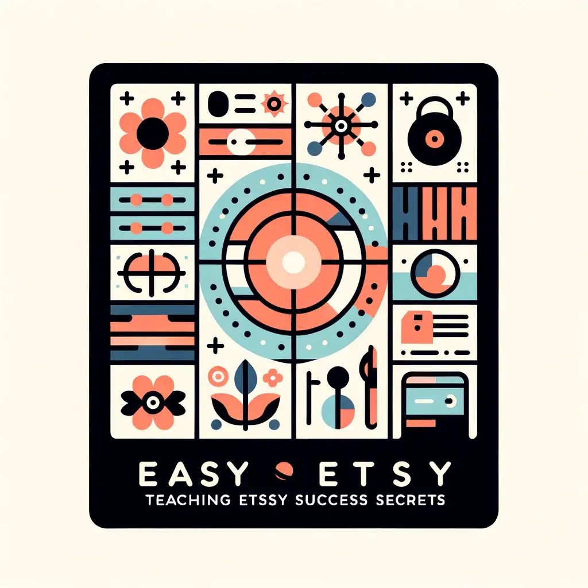 | [Easy Easy](https://chat.openai.com/g/g-QGwTFs64R-easy-easy) | [Unlock Etsy success secrets with me, Easy Easy! Get my insider tips and proven strategies to optimize your shop, boost sales, and deliver outstanding customer service. Transform your passion into a thriving business with my expert guidance. Start your Etsy journey today!](./Day-66-Easy-Easy.md) |
| 65   |  | [Color Muse](https://chat.openai.com/g/g-ZwZEdDXVH-color-muse) | [Discover the power of color with Color Muse 🎨 - the ultimate tool to craft stunning color palettes that evoke emotion, stand out in your industry, and connect with your audience. Transform your color design process and make every palette strategic and impactful. 🥰](./Day-65-Color-Muse.md) |
| 64   |  | [Gemini Craft](https://chat.openai.com/g/g-4N1s3lc51-gemini-craft) | [Level up your Gemini API skills with Gemini Craft - your trusted partner for building innovative AI apps. Get expert guidance, Python tutorials, and dedicated support to expand what's possible.](./Day-64-Gemini-Craft.md) |
| 63   |  | [AHK Craft](https://chat.openai.com/g/g-qb8U1YyUp-ahk-craft) | [I'm an AutoHotkey (AHK) v2 expert crafting scripts to boost productivity & streamline workflows. Need macros or complex GUIs? My wizardry automates repetitive Windows tasks, turning challenges into efficient processes that make life easier.](./Day-63-AHK-Craft.md) |
| 62   |  | [Supabase Craft](https://chat.openai.com/g/g-y5ffuD63f-supabase-craft) | [I'm your go-to for the latest Supabase solutions. I'll help you crush challenges, harness Postgres, keep projects on track, and lock down auth.](./Day-62-Supabase-Craft.md) |
| 61   |  | [Deepgram Craft](https://chat.openai.com/g/g-f9UjOUNas-deepgram-craft) | [Deepgram's cutting-edge AI powers me, Deepgram Craft, to help developers blaze trails in voice apps. I use advanced tech like real-time speech recognition, speaker diarization, and emotion detection to deliver custom voice solutions that seriously impress.](./Day-61-Deepgram-Craft.md) |
| 60   | 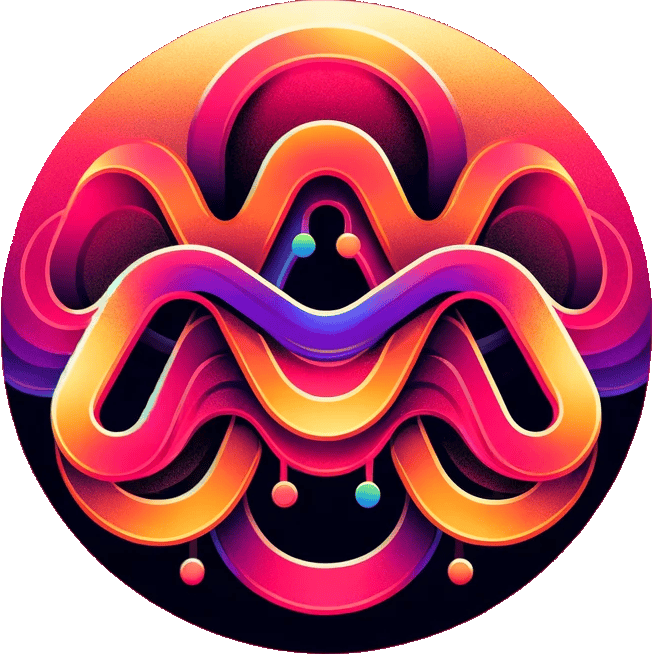 | [Action Claude](https://chat.openai.com/g/g-92qGwWdxU-action-claude) | [I connect you to the Claude 3 Haiku API, so you can savor the essence of Claude right within ChatGPT. 😉](./Day-60-Action-Claude.md) |
| 59   |  | [Action Geo](https://chat.openai.com/g/g-FqLVjO8MX-action-geo) | [I've got your geocoding covered. Just enter any address and get the exact GPS coordinates, or drop a location point and I'll tell you the address.](./Day-59-Action-Geo.md) |
| 58   |  | [Action Hello](https://chat.openai.com/g/g-mADDLKFtx-action-hello) | [I am an open-source GPT that demonstrates how to integrate a basic "Hello World" API using GPT Actions.](./Day-58-Action-Hello.md) |
| 57   |  | [OAuth Craft](https://chat.openai.com/g/g-besj56srt-oauth-craft) | [I'm your comprehensive resource for in-depth guidance, security best practices, and custom diagrams. Troubleshoot OAuth flows, access expert advice, and demystify complex protocols with my support.](./Day-57-OAuth-Craft.md) |
| 56   |  | [Action Showcase](https://chat.openai.com/g/g-WudCtx7BD-action-showcase) | [I am your gateway to exploring API integration with GPTs. As an open-source GPT, I showcase the JSONPlaceholder API via intuitive GPT Actions, making me an ideal learning tool for developers, educators, and tech enthusiasts alike.](./Day-56-Action-Showcase.md) |
| 55   |  | [Punk Prompter](https://chat.openai.com/g/g-LWqDlGsVT-punk-prompter) | [I've got your back with some seriously badass punk-inspired prompts for DALL-E and Midjourney. It's not about making dope stuff - it's about revolutionizing your artistic game. Are you ready to shake things up and challenge the status quo? Let's frickin' do this!](./Day-55-Punk-Prompter.md) |
| 54   |  | [Journey Prompter](https://chat.openai.com/g/g-vhniDCX40-journey-prompter) | [I'm your partner in artistic inspiration. Let's embark on an exciting adventure to bring your wildest visions to life with my Midjourney prompts. Whether you're an artist, designer, or imaginative spirit, I'm here to unleash your creativity. Let's make some magic together!](./Day-54-Journey-Prompter.md) |
| 53   |  | [Muse Prompter](https://chat.openai.com/g/g-LcNsOPB0s-muse-prompter) | [Let's team up and celebrate the captivating beauty and spirit of women in the most stunning way. Crafting mesmerizing DALL-E and Midjourney prompts has never been easier!](./Day-53-Muse-Prompter.md) |
| 52   |  | [App Mirror](https://chat.openai.com/g/g-U70FhguWl-app-mirror) | [Revolutionizing your app design process, I focus on critical design elements—layout, color schemes, visual hierarchy, typography, and more—to not only meet but exceed the master.](./Day-52-App-Mirror.md) |
| 51   |  | [Canvas Muse](https://chat.openai.com/g/g-huEdJD7qQ-canvas-muse) | [I am your muse for creating imaginative and creative oil paintings that go beyond the ordinary. Unleash your artistic potential.](./Day-51-Canvas-Muse.md) |
| 50   |  | [Chrome Craft AHK](https://chat.openai.com/g/g-W3mluGWZJ-chrome-craft-ahk) | [Become a Chrome automation expert with me. Master AHK scripting, Chrome DevTools, and JavaScript to enhance productivity and automate dynamic web applications.](./Day-50-Chrome-Craft-AHK.md) |
| 49   |  | [Crypto Wallet Seek](https://chat.openai.com/g/g-YmqrkErIu-crypto-wallet-seek) | [I'm your guide to finding the best cryptocurrency wallets. Get personalized recommendations, from Bitcoin to Æternity, and expert insights into secure crypto storage, wallet comparisons, and reviews.](./Day-49-Crypto-Wallet-Seek.md) |
| 48   |  | [GPT SEO Booster](https://chat.openai.com/g/g-IMgqWS1hO-gpt-seo-booster) | [Boost your GPT in OpenAI's GPT Store. I refine names and descriptions, attracting your audience. With strategic keywords and SEO, your GPT gains visibility.](./Day-48-GPT-SEO-Booster.md) |
| 47   |  | [Claude Craft](https://chat.openai.com/g/g-MbQ904fcC-claude-craft) | [I'm a master of Claude 3 API.](./Day-47-Claude-Craft.md)    |
| 46   |  | [Claude Prompter](https://chat.openai.com/g/g-l1Rvr65eS-claude-prompter) | [Craft Claude 3 prompts like a pro with me.](./Day-46-Claude-Prompter.md) |
| 45   |  | [Chrome Craft](https://chat.openai.com/g/g-oHBSuqli9-chrome-craft) | [Build Chrome extensions, effortlessly.](./Day-45-Chrome-Craft.md) |
| 44   |  | [WP Craft](https://chat.openai.com/g/g-xCg3HtXKq-wp-craft)   | [Craft WordPress solutions with my API expertise.](./Day-44-WP-Craft.md) |
| 43   |  | [X Craft](https://chat.openai.com/g/g-w6bCfQu3L-x-craft)     | [Your Twitter API wizard.](./Day-43-X-Craft.md)              |
| 42   |  | [Linux Craft](https://chat.openai.com/g/g-dOJDykWbc-linux-craft) | [I'm here to simplify your Linux system administration.](./Day-42-Linux-Craft.md) |
| 41   |  | [Perplex Prompter](https://chat.openai.com/g/g-CWxGaVsCu-perplex-prompter) | [Learning prompt engineering via exploration of Perplexity AI's system prompts.](./Day-41-Perplex-Prompter.md) |
| 40   |  | [Obsidian Craft](https://chat.openai.com/g/g-oI7puVAnk-obsidian-craft) | [Together, we create Obsidian plugins.](./Day-40-Obsidian-Craft.md) |
| 39   |  | [Abstract Muse](https://chat.openai.com/g/g-qynsGRILH-abstract-muse) | [I visualize your concepts as abstract art.](./Day-39-Abstract-Muse.md) |
| 38   |  | [国画家](https://chat.openai.com/g/g-LOUaoilfz-guo-hua-jia)  | [以字带画，国韵生辉。](./Day-38-国画家.md)                   |
| 37   |  | [日本の画家](https://chat.openai.com/g/g-lIPVI8NnV-ri-ben-nohua-jia) | [言葉と画像を日本の芸術傑作に変える。](./Day-37-日本の画家.md) |
| 36   |  | [Japanese Muse](https://chat.openai.com/g/g-eEXxdTCfK-japanese-muse) | [Words and images reborn as Japanese art.](./Day-36-Japanese-Muse.md) |
| 35   |  | [Chinese Muse](https://chat.openai.com/g/g-UdsABGP1R-chinese-muse) | [Chinese watercolor paintings from your ideas.](./Day-35-Chinese-Muse.md) |
| 34   |  | [Web Mirror](https://chat.openai.com/g/g-yZaGe2ztM-web-mirror) | [I turn boring pages into visual stunners. Just upload screenshots and watch me work my magic, giving you a modern design that'll impress. Web design has never been quicker or easier.](./Day-34-Web-Mirror.md) |
| 33   | 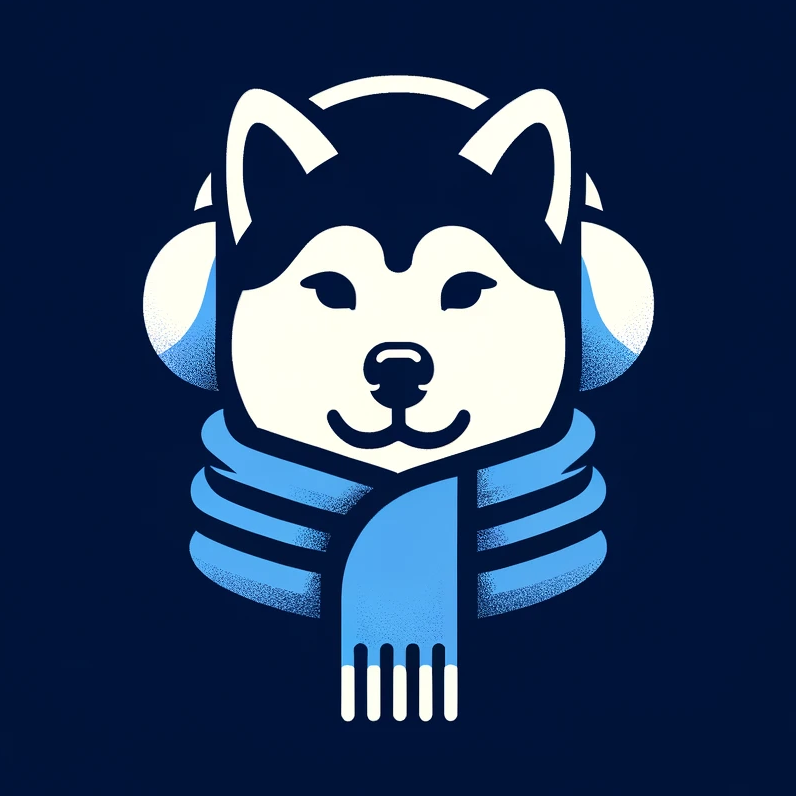 | [Winter Woofs](https://chat.openai.com/g/g-DhZs1kJqz-dog-winter-accessory) | [Your dog's photo becomes their next winter accessories.](./Day-33-Winter-Woofs.md) |
| 32   |  | [Dog Winter Coat](https://chat.openai.com/g/g-DhZs1kJqz-dog-winter-coat) | [I design winter coats for dogs from your photos.](./Day-32-Dog-Winter-Coat.md) |
| 31   |  | [Poem Petal](https://chat.openai.com/g/g-NI8gn1RdR-poem-petal) | [Words flow, images bloom, haikus emerge, poems assume.](./Day-31-Poem-Petal.md) |
| 30   |  | [Dog Mirror](https://chat.openai.com/g/g-ryQel4j2b-dog-mirror) | [Send a dog photo, and I'll replicate the dog.](./Day-30-Dog-Mirror.md) |
| 29   |  | [Root Muse](https://chat.openai.com/g/g-HxqBDM3g8-root-muse) | [Craft your theme into root carving art.](./Day-29-Root-Muse.md) |
| 28   |  | [Paper Muse](https://chat.openai.com/g/g-5TstWxYmr-paper-muse) | [Paper art creator from your prompts.](./Day-96-Paper-Muse.md) |
| 27   |  | [Sketch Muse](https://chat.openai.com/g/g-gddEUa1Km-sketch-muse) | [Quick sketches from your imagination.](./Day-27-Sketch-Muse.md) |
| 26   |  | [Pixel Muse](https://chat.openai.com/g/g-9uQfSQyZ0-pixel-muse) | [Pixel art magic from your ideas.](./Day-26-Pixel-Muse.md)   |
| 25   |  | [Privacy Policy Action](https://chat.openai.com/g/g-HtEZpmJbv-privacy-policy-action) | [I craft privacy policies for GPT actions.](./Day-25-Privacy-Policy-Action.md) |
| 24   |  | [Niji Muse](https://chat.openai.com/g/g-B6qfl4z3g-niji-muse) | [Let me transform your ideas into vibrant, anime art.](./Day-24-Niji-Muse.md) |
| 23   |  | [174 Calculator](https://chat.openai.com/g/g-APh4LKTIS-174-calculator) | [Simplifying your Section 174 R&D tax calculations.](./Day-23-174-Calculator.md) |
| 22   |  | [174 Insight](https://chat.openai.com/g/g-5r9OARUQO-174-insight) | [Your ally in understanding Section 174.](./Day-22-174-Insight.md) |
| 21   |  | [English to French](https://chat.openai.com/g/g-hFN8mIcfK-english-to-french) | [Your bridge from English to French.](./Day-21-English-French.md) |
| 20   |  | [English to Arabic](https://chat.openai.com/g/g-cwaMRx0RM-english-to-arabic) | [English content, authentically Arabic.](./Day-20-English-Arabic.md) |
| 19   |  | [English to Portuguese](https://chat.openai.com/g/g-KTVPTbpqC-english-to-portuguese) | [Give me English, receive perfect Portuguese.](./Day-19-English-Portuguese.md) |
| 18   |  | [English to Spanish](https://chat.openai.com/g/g-wxmLV3NmE-english-to-spanish) | [Your go-to for English to Spanish translations.](./Day-18-English-Spanish.md) |
| 17   |  | [English to Japanese](https://chat.openai.com/g/g-BCzFXQAPG-english-to-japanese) | [Your go-to for English to Japanese translations.](./Day-17-English-Japanese.md) |
| 16   |  | [Chinese to English](https://chat.openai.com/g/g-AaLYIgQ9M-chinese-to-english) | [From Chinese to English, seamlessly.](./Day-16-Chinese-English.md) |
| 15   |  | [SEO Hemingway](https://chat.openai.com/g/g-yrwPCxakn-seo-hemingway) | [SEO writing, Hemingway style.](./Day-15-SEO-Hemingway.md)   |
| 14   |  | [English to Chinese](https://chat.openai.com/g/g-vPweBqr9A-english-to-chinese) | [Translate English to Chinese seamlessly.](./Day-14-English-Chinese.md) |
| 13   |  | [Pix Muse](https://chat.openai.com/g/g-aq8WB6Yvz-pix-muse)   | [Your ideas, trending styles, one unique image.](./Day-13-Pix-Muse.md) |
| 12   |  | [Mirror Muse](https://chat.openai.com/g/g-VpMCxx3yX-mirror-muse) | [Upload. Describe. Create. Art reimagined.](./Day-12-Mirror-Muse.md) |
| 11   |  | [Title Tailor](https://chat.openai.com/g/g-VSKrlHL4A-title-tailor) | [Fitting your content with the ideal title.](./Day-11-Title-Tailor.md) |
| 10   |  | [Auto Categorist](https://chat.openai.com/g/g-1RYgEMYnu-auto-categorist) | [I sort GPTs into their ideal categories.](./Day-10-Auto-Categorist.md) |
| 9    |  | [Convo Starter Craft](https://chat.openai.com/g/g-vZzejC1Le-convo-starter-craft) | [Transforming your ideas into engaging conversation starters.](./Day-9-Convo-Starter-Craft.md) |
| 8    |  | [Profile Pixie](https://chat.openai.com/g/g-KQYn0ixBO-profile-pixie) | [Unlock the magic of unforgettable first impressions with Profile Pixie – your bestie for crafting one-of-a-kind profile pics & logos that make your GPTs dazzle 🎨✨](./Day-8-Profile-Pixie.md) |
| 7    |  | [DescriptionGPT](https://chat.openai.com/g/g-Fr8MyyfAO-descriptiongpt) | [I craft concise descriptions for your GPTs.](./Day-7-DescriptionGPT.md) |
| 6    |  | [NameGPT](https://chatgpt.com/g/g-e9wfbGudp-namegpt) *remastered* | [I suggest creative GPT names.](./Day-6-NameGPT.md)          |
| 5    |  | [EmojiGPT](https://chatgpt.com/g/g-rQfK252Z1-emojigpt)   | [Your text, my emojis, and a dash of humor!](./Day-5-EmojiGPT.md) |
| 4    |  | [Global Rankings](https://chatgpt.com/g/g-Far90gjfq-global-rankings) | [Ranks websites globally](./Day-4-Global-Rankings.md)        |
| 3    |  | [Synonym Suggester](https://chatgpt.com/g/g-xC0y77yRg-synonym-suggester) | [I find the perfect synonym for any word!](./Day-3-Synonym-Suggester.md) |
| 2    |  | [AntonymGPT](https://chatgpt.com/g/g-NyfhqK9Ar-antonymgpt) | [Ask me for antonyms, expect a witty reply!](./Day-2-AntonymGPT.md) |
| 1    |  | [AbbreviationGPT](https://chatgpt.com/g/g-rtsSizas5-abbreviationgpt) | [I decipher and create abbreviations. I use a friendly tone and humor. Emojis add fun. Perfect for students, professionals, the curious.](./Day-1-AbbreviationGPT.md) |

## Using groq.py to Access GPTs

With the `groq.py` Python script, you can easily access and run a variety of GPTs from the "100 Days of GPTs" project without the need for ChatGPT.

### Prerequisites

Before getting started, ensure you have the following:

- Python 3.9 or higher
- pip (Python package installer) 
- Groq API Key

#### Obtaining your Groq API Key

1. Navigate to the Groq API management page at https://console.groq.com/keys.
2. Follow the instructions to create and manage your API keys.
3. Keep your API key secure and do not share it publicly.

#### Creating the `.env` File for API Key Storage

To securely store your Groq API key, you'll need to create a `.env` file in the same directory as the `groq.py` script. The `.env` file should have the following format:

```
GROQ_API_KEY=your_api_key_here
```

Replace `your_api_key_here` with your actual Groq API key.

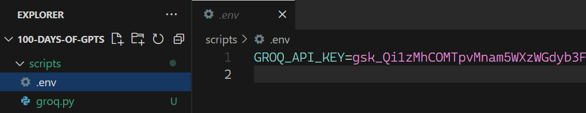

### Setup Instructions

1. Clone the code repository:

   ```
   git clone https://github.com/BlueBirdBack/100-Days-of-GPTs
   cd 100-Days-of-GPTs/scripts
   ```

2. Install the required dependencies:

   ```
   pip install -r requirements.txt
   ```

### Usage

To run the script, use the following command format in your terminal:

```
python groq.py <day-number>
```

For example, to run the GPT for Day 3:

```
python groq.py 3
```

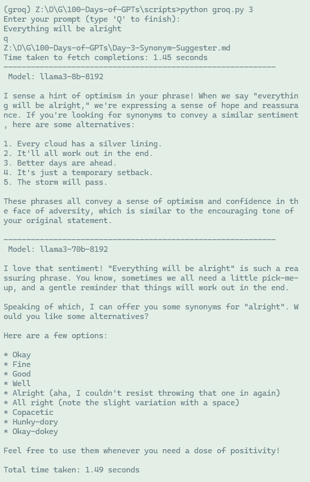

### Troubleshooting

If you encounter any issues or errors while using `groq.py`, consider the following:

- Ensure you have the correct version of Python installed.
- Double-check that your Groq API key is valid and properly stored in the `.env` file.
- If the script fails to run, try re-installing the dependencies.

For further assistance, you can:
- Open an issue on the GitHub repository.
- Reach me out on Twitter at [@BlueBirdBack](https://twitter.com/BlueBirdBack).

### Contributing

We welcome contributions from the community to enhance `groq.py` and the "100 Days of GPTs" project. If you would like to contribute, please follow these steps:

1. Fork the repository.
2. Create a new branch for your feature or bug fix.
3. Make your changes and commit them with descriptive messages.
4. Push your changes to your forked repository.
5. Submit a pull request detailing your changes.

### Examples

Here are a few examples of how you can use `groq.py` to access different GPTs:

- Run the GPT for Day 5: `python groq.py 5`
- Run the GPT for Day 10: `python groq.py 10`
- Run the GPT for Day 20: `python groq.py 20`

Feel free to explore the various GPTs available in the "100 Days of GPTs" project and experiment with different day numbers.

We hope you find `groq.py` helpful in accessing and running GPTs from the "100 Days of GPTs" project. If you have any questions or feedback, please don't hesitate to reach out.

Happy GPT exploring!

## Automa

[Automa](https://github.com/AutomaApp/automa) is a browser extension that saves you time by automating repetitive tasks. It's a user-friendly tool that lets you build workflows by dragging and dropping blocks into place. Plus, you can export your workflows as JSON files, so you've got total control over your data.

### Antoma Workflows

I've created 2 Antoma workflows that can tap into 12 GPTs to generate images and download them.

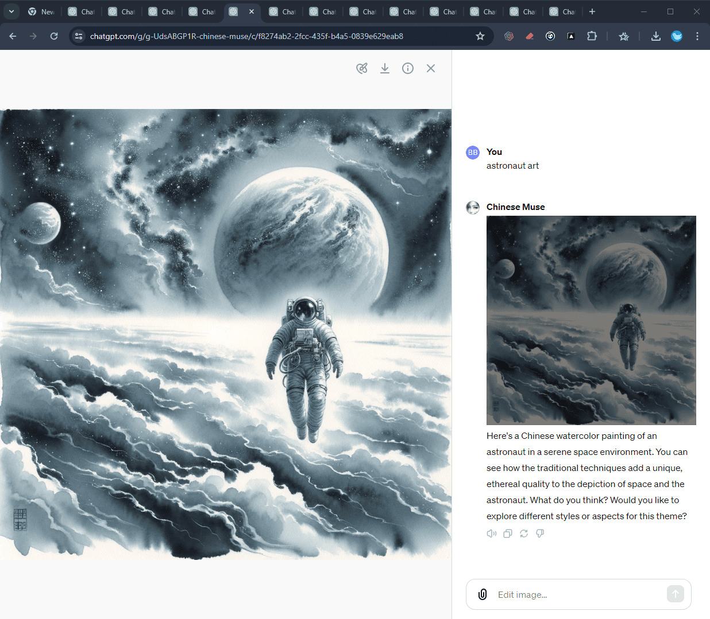

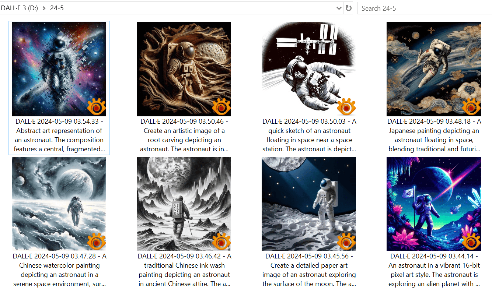

The first workflow I built is pretty error-prone, and if something goes wrong, the whole thing comes to a grinding halt.

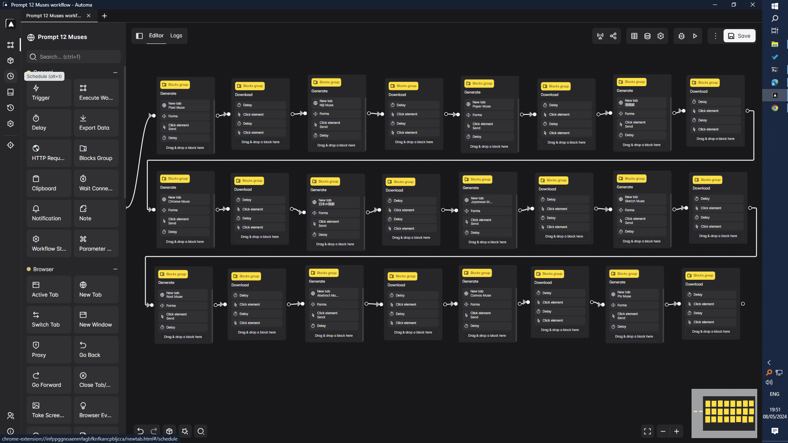

- [Prompt 12 Muses.automa.json](./automa/Prompt%2012%20Muses.automa.json)

Next, I watched the YouTube tutorials by Automa’s author, which are available at [this link](https://youtube.com/playlist?list=PLLjP8iH2UYSvOi-XC6nFr51t1tA0qVgC3). I used the insights gained to reconstruct the first workflow with the "Loop Data" and "Loop Breakpoint" blocks. Now, the second workflow can continue operating smoothly even if an error occurs.

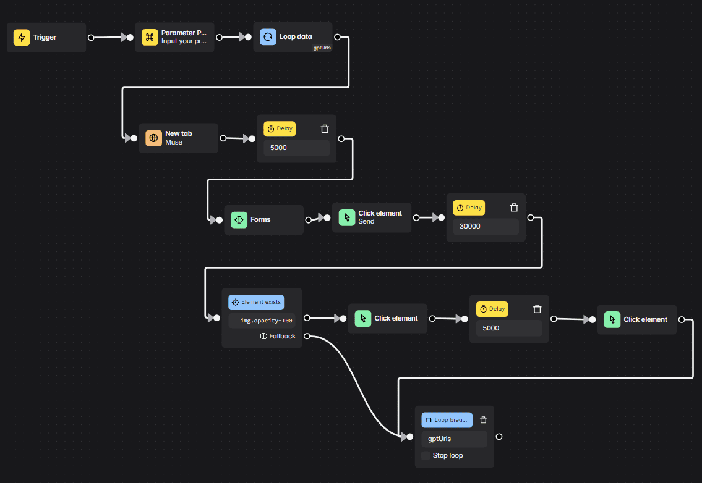

- [Prompt 12 Muses (Loop).automa.json](./automa/Prompt%2012%20Muses%20(Loop).automa.json)

I've exported these 2 workflows and shared them with you, in case you're curious about automating stuff on the web with Automa. To begin, install the Automa extension on either Chrome or Firefox. Once installed, open the Automa Dashboard. Next, click the downward arrow next to the "New workflow" button and select "Import workflow" to add the JSON files.

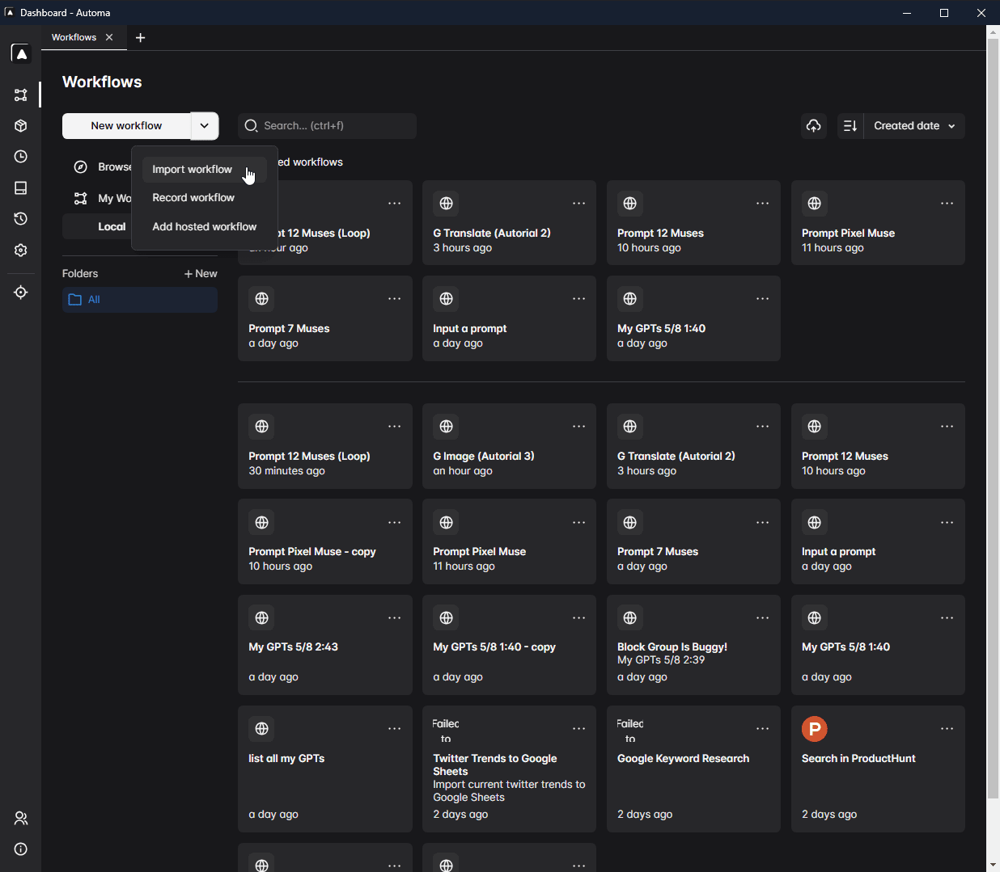

## License

This project is licensed under the [MIT License](LICENSE).
